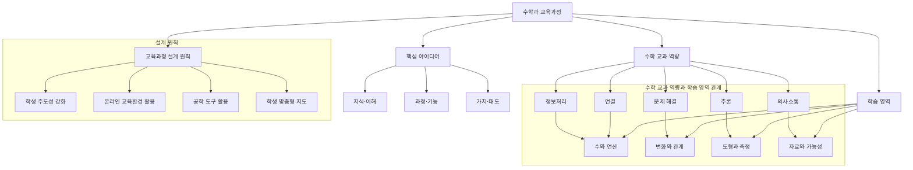

```mermaid
graph TD;
    A[수학과 교육과정]

    A --> B[핵심 아이디어]
    B --> C[지식⋅이해]
    B --> D[과정⋅기능]
    B --> E[가치⋅태도]

    A --> F[수학 교과 역량]
    F --> G[문제 해결]
    F --> H[추론]
    F --> I[의사소통]
    F --> J[연결]
    F --> K[정보처리]

    A --> L[학습 영역]
    L --> M[수와 연산]
    L --> N[변화와 관계]
    L --> O[도형과 측정]
    L --> P[자료와 가능성]

    subgraph "수학 교과 역량과 학습 영역 관계"
        G --> N
        H --> O
        I --> P
        J --> M
        K --> M
    end

    A --> Q[교육과정 설계 원칙]
    subgraph "설계 원칙"
        Q --> R[학생 주도성 강화]
        Q --> S[온라인 교육환경 활용]
        Q --> T[공학 도구 활용]
        Q --> U[학생 맞춤형 지도]
    end

```
