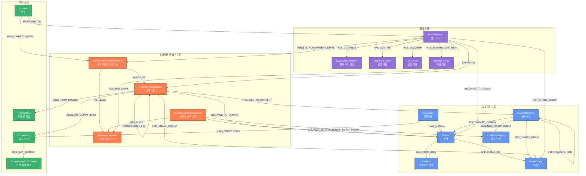
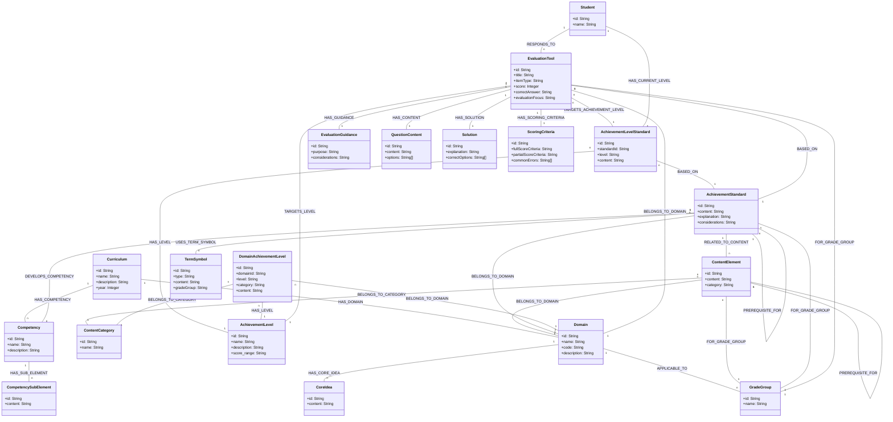

## 6. 구현 고려사항 (계속)

### 6.1 성능 최적화 (계속)

2. **쿼리 최적화**: 복잡한 쿼리의 경우 PROFILE 명령어를 사용하여 실행 계획을 확인하고 최적화합니다.
3. **데이터 파티셔닝**: 학년군이나 영역별로 데이터를 논리적으로 구분하여 관리합니다.
4. **캐싱 전략**: 자주 사용되는 쿼리 결과는 애플리케이션 레벨에서 캐싱하여 데이터베이스 부하를 줄입니다.

### 6.2 데이터 무결성 관리

1. **제약 조건 적용**: 주요 노드의 ID에 대한 유니크 제약 조건을 설정하여 데이터 무결성을 보장합니다.
2. **트랜잭션 관리**: 데이터 수정 시 트랜잭션을 활용하여 일관성을 유지합니다.
3. **데이터 검증**: 데이터 입력 전 유효성 검사를 수행하여 잘못된 데이터가 입력되는 것을 방지합니다.
4. **관계 일관성**: 관계 생성 시 양쪽 노드의 존재 여부를 확인하여 잘못된 관계가 생성되지 않도록 합니다.

### 6.3 확장성 고려

1. **교육과정 버전 관리**: 교육과정 개정에 대비한 버전 관리 전략을 수립합니다.
2. **노드 및 관계 확장성**: 새로운 유형의 노드나 관계를 추가할 수 있도록 유연한 모델을 유지합니다.
3. **메타데이터 확장**: 추가적인 메타데이터(예: 학습 자료, 교수 전략)를 포함할 수 있도록 설계합니다.
4. **다국어 지원**: 필요한 경우 다국어 지원을 위한 구조를 고려합니다.

## 7. 데이터 통합 및 유지 관리

### 7.1 데이터 소스 통합

1. **문서 파싱**: 교육과정 문서(PDF, DOCX)에서 구조화된 데이터를 추출하는 파서 개발
2. **데이터 변환**: 추출된 데이터를 Neo4j 임포트 형식으로 변환하는 ETL 프로세스 구축
3. **데이터 검증**: 변환된 데이터의 완전성과 정확성을 검증하는 절차 수립
4. **데이터 로딩**: 검증된 데이터를 Neo4j에 일괄 로딩하는 프로세스 자동화

### 7.2 데이터 유지 관리

1. **정기적인 백업**: 데이터베이스 정기 백업 및 복구 전략 수립
2. **버전 관리**: 교육과정 개정에 따른 데이터 버전 관리 전략 구현
3. **변경 이력 관리**: 데이터 변경 이력을 추적하기 위한 메커니즘 구현
4. **데이터 품질 모니터링**: 데이터 품질을 정기적으로 모니터링하고 개선하는 프로세스 수립

### 7.3 사용자 피드백 통합

1. **피드백 수집**: 교사 및 학생들로부터 평가 도구 및 학습 자료에 대한 피드백 수집
2. **품질 개선**: 수집된 피드백을 바탕으로 데이터 품질 및 연결성 개선
3. **사용자 생성 콘텐츠**: 교사들이 생성한 평가 도구나 학습 자료를 데이터베이스에 통합
4. **협업 플랫폼**: 교사들 간 협업을 통한 데이터 개선 및 확장 지원

## 8. API 및 서비스 설계

### 8.1 REST API 엔드포인트

1. **교육과정 조회 API**

    - `GET /api/curriculum`: 교육과정 기본 정보 조회
    - `GET /api/domains`: 영역 목록 조회
    - `GET /api/domains/{id}`: 특정 영역 상세 정보 조회

2. **성취기준 관련 API**

    - `GET /api/standards`: 성취기준 목록 조회(필터링 옵션 제공)
    - `GET /api/standards/{id}`: 특정 성취기준 상세 정보 조회
    - `GET /api/standards/{id}/levels`: 성취기준별 성취수준 조회

3. **평가 도구 관련 API**

    - `GET /api/evaluation-tools`: 평가 도구 목록 조회(필터링 옵션 제공)
    - `GET /api/evaluation-tools/{id}`: 특정 평가 도구 상세 정보 조회
    - `POST /api/evaluation-tools`: 새로운 평가 도구 생성
    - `PUT /api/evaluation-tools/{id}`: 평가 도구 정보 수정

4. **학습자 지원 API**
    - `GET /api/students/{id}/diagnostics`: 학생 진단 정보 조회
    - `POST /api/students/{id}/responses`: 학생 평가 응답 제출
    - `GET /api/students/{id}/recommendations`: 맞춤형 학습 추천 조회

### 8.2 GraphQL API

복잡한 쿼리와 관계 탐색이 필요한 경우를 위한 GraphQL API 스키마 예시:

```graphql
type Curriculum {
    id: ID!
    name: String!
    description: String
    year: Int
    domains: [Domain!]!
    competencies: [Competency!]!
}

type Domain {
    id: ID!
    name: String!
    code: String!
    description: String
    coreIdeas: [CoreIdea!]!
    achievementStandards: [AchievementStandard!]!
    contentElements: [ContentElement!]!
    domainAchievementLevels: [DomainAchievementLevel!]!
}

type AchievementStandard {
    id: ID!
    content: String!
    explanation: String
    considerations: String
    domain: Domain!
    gradeGroup: GradeGroup!
    relatedContentElements: [ContentElement!]!
    developedCompetencies: [Competency!]!
    achievementLevels: [AchievementLevelStandard!]!
    evaluationTools: [EvaluationTool!]!
}

# 기타 타입 정의...

type Query {
    curriculum(id: ID!): Curriculum
    domains(gradeGroup: String): [Domain!]!
    achievementStandards(
        domainId: ID
        gradeGroup: String
    ): [AchievementStandard!]!
    evaluationTools(standardId: ID, levelId: ID): [EvaluationTool!]!
    studentDiagnostics(studentId: ID!): [StudentDiagnostic!]!
}

type Mutation {
    createEvaluationTool(input: EvaluationToolInput!): EvaluationTool
    updateEvaluationTool(id: ID!, input: EvaluationToolInput!): EvaluationTool
    submitStudentResponse(input: StudentResponseInput!): StudentDiagnostic
}
```

### 8.3 서비스 계층 설계

1. **데이터 액세스 레이어**

    - Neo4j 데이터베이스와의 직접적인 상호작용을 담당
    - Cypher 쿼리 실행 및 결과 변환
    - 트랜잭션 관리 및 오류 처리

2. **비즈니스 로직 레이어**

    - 교육과정 및 평가 관련 비즈니스 규칙 구현
    - 데이터 검증 및 변환 로직
    - 권한 및 접근 제어 관리

3. **API 레이어**

    - REST 및 GraphQL 엔드포인트 제공
    - 요청 유효성 검사 및 응답 포맷팅
    - 캐싱 및 속도 제한 처리

4. **분석 레이어**
    - 복잡한 분석 쿼리 및 알고리즘 구현
    - 맞춤형 추천 엔진 제공
    - 데이터 시각화 및 리포팅 기능

## 9. 애플리케이션 시나리오 예시

### 9.1 교사용 교육과정 네비게이터 시나리오

1. **교사 로그인**: 교사가 시스템에 로그인합니다.
2. **영역 및 성취기준 탐색**: 교사가 "수와 연산" 영역을 선택하고 중학교 1~3학년 성취기준을 조회합니다.
3. **성취기준 상세 조회**: 교사가 "9수01-01" 성취기준을 선택하여 상세 정보를 확인합니다.
4. **성취수준별 지도 방안 확인**: 각 성취수준(A~E)에 대한 상세 내용을 확인하고 지도 계획을 수립합니다.
5. **관련 평가 도구 조회**: 해당 성취기준에 대한 평가 도구를 조회하고 수업에 활용합니다.
6. **맞춤형 평가지 생성**: 여러 성취기준과 성취수준을 고려한 맞춤형 평가지를 생성합니다.

### 9.2 학생 맞춤형 학습 시나리오

1. **학생 진단 평가**: 학생이 진단 평가를 통해 현재 성취수준을 확인합니다.
2. **개인화된 학습 경로**: 시스템이 학생의 현재 성취수준에 기반하여 맞춤형 학습 경로를 제안합니다.
3. **단계별 학습 활동**: 학생이 현재 수준에서 다음 수준으로 발전하기 위한 단계별 학습 활동을 수행합니다.
4. **형성 평가**: 각 단계마다 형성 평가를 통해 학습 진행 상황을 확인합니다.
5. **진전도 모니터링**: 학생과 교사가 성취수준별 진전도를 모니터링하고 필요한 조치를 취합니다.
6. **학습 목표 달성**: 목표 성취수준에 도달하면 다음 학습 단계로 진행합니다.

### 9.3 교육과정 분석 시나리오

1. **교육과정 매핑**: 영역별, 학년군별 성취기준 분포를 시각화하여 교육과정 구조를 분석합니다.
2. **역량 분석**: 성취기준별로 강조되는 교과 역량을 분석하여 역량 함양 현황을 파악합니다.
3. **평가 도구 효과성 분석**: 평가 도구별 학생 응답 패턴을 분석하여 효과성을 평가합니다.
4. **학습 경로 최적화**: 학생들의 성취수준 향상 패턴을 분석하여 최적의 학습 경로를 도출합니다.
5. **교육과정 개선 제안**: 분석 결과를 바탕으로 교육과정 및 교수·학습 방법 개선 방안을 제안합니다.

## 10. 결론 및 향후 과제

### 10.1 주요 이점

1. **통합적 교육과정 관리**: 교육과정의 복잡한 요소들을 유기적으로 연결하여 통합적 관리가 가능합니다.
2. **맞춤형 교수·학습 지원**: 학생과 교사의 요구에 맞는 맞춤형 교수·학습 자료 및 전략을 제공합니다.
3. **데이터 기반 의사결정**: 교육과정 분석 및 학생 성취 데이터를 기반으로 한 효과적인 의사결정을 지원합니다.
4. **협력적 교육자원 공유**: 교사들 간의 교육자원 공유 및 협력을 촉진합니다.

### 10.2 한계점

1. **데이터 품질 의존성**: 초기 데이터 구축의 품질에 크게 의존하며, 불완전한 데이터는 시스템 효과성을 저하시킬 수 있습니다.
2. **복잡한 구현**: 교육과정의 복잡성으로 인해 초기 구현 및 유지보수가 복잡할 수 있습니다.
3. **사용자 적응 문제**: 새로운 시스템에 대한 교사와 학생의 적응이 필요합니다.
4. **기술적 제약**: 대규모 데이터셋과 복잡한 쿼리에 대한 성능 최적화 과제가 있습니다.

### 10.3 향후 발전 방향

1. **AI 기반 추천 시스템**: 인공지능 기술을 활용한 더 정교한 학습 경로 추천 및 평가 도구 생성
2. **학습 분석 고도화**: 학생 학습 패턴 및 성취도에 대한 더 깊은 분석을 위한 학습 분석 도구 개발
3. **다양한 평가 방식 통합**: 포트폴리오, 수행평가 등 다양한 평가 방식을 통합하는 확장 모델 개발
4. **교육과정 간 연계**: 타 교과 및 교육과정과의 연계를 지원하는 확장 모델 구축
5. **국제 표준 통합**: 국제 교육 표준과의 호환성 확보 및 글로벌 교육 리소스 연계

이 문서는 2022 개정 교육과정 수학과 메타데이터의 Neo4j 그래프 데이터베이스 구축을 위한 종합적인 설계 지침을 제공합니다. 이를 통해 교육과정의 복잡한 구성 요소들 간의 관계를 효과적으로 모델링하고, 교사와 학생을 위한 맞춤형 교육 지원 시스템을 구현할 수 있습니다.

---

수학 교육과정 메타데이터 구조를 Mermaid 다이어그램으로 나타내겠습니다.

```mermaid
graph TD
    %% 스타일 정의
    classDef curriculumClass fill:#6495ED,color:white,stroke:#333
    classDef achievementClass fill:#FF7F50,color:white,stroke:#333
    classDef evaluationClass fill:#9370DB,color:white,stroke:#333
    classDef competencyClass fill:#3CB371,color:white,stroke:#333

    %% 1. 교육과정 구조 노드
    C[Curriculum<br>교육과정] --> |HAS_DOMAIN| D1[Domain<br>수와 연산]
    C --> |HAS_DOMAIN| D2[Domain<br>변화와 관계]
    C --> |HAS_DOMAIN| D3[Domain<br>도형과 측정]
    C --> |HAS_DOMAIN| D4[Domain<br>자료와 가능성]

    D1 --> |HAS_CORE_IDEA| CI1[CoreIdea<br>핵심 아이디어]
    D1 --> |APPLICABLE_TO| GG1[GradeGroup<br>학년군]
    D1 --> |APPLICABLE_TO| GG2[GradeGroup<br>학년군]

    CE1[ContentElement<br>내용 요소] --> |BELONGS_TO_CATEGORY| CC1[ContentCategory<br>지식·이해]
    CE2[ContentElement<br>내용 요소] --> |BELONGS_TO_CATEGORY| CC2[ContentCategory<br>과정·기능]
    CE3[ContentElement<br>내용 요소] --> |BELONGS_TO_CATEGORY| CC3[ContentCategory<br>가치·태도]

    CE1 --> |BELONGS_TO_DOMAIN| D1
    CE1 --> |FOR_GRADE_GROUP| GG1
    CE1 --> |PREREQUISITE_FOR| CE2

    %% 2. 성취기준 및 성취수준 노드
    AS1[AchievementStandard<br>성취기준] --> |BELONGS_TO_DOMAIN| D1
    AS1 --> |FOR_GRADE_GROUP| GG1
    AS1 --> |RELATED_TO_CONTENT| CE1
    AS1 --> |PREREQUISITE_FOR| AS2[AchievementStandard<br>성취기준]

    ALS1[AchievementLevelStandard<br>성취기준별 성취수준] --> |BASED_ON| AS1
    ALS1 --> |HAS_LEVEL| AL1[AchievementLevel<br>A]
    ALS2[AchievementLevelStandard<br>성취기준별 성취수준] --> |BASED_ON| AS1
    ALS2 --> |HAS_LEVEL| AL2[AchievementLevel<br>B]

    DAL1[DomainAchievementLevel<br>영역별 성취수준] --> |BELONGS_TO_DOMAIN| D1
    DAL1 --> |HAS_LEVEL| AL1
    DAL1 --> |BELONGS_TO_CATEGORY| CC1

    %% 3. 평가 관련 노드
    ET1[EvaluationTool<br>평가 도구] --> |BASED_ON| AS1
    ET1 --> |TARGETS_LEVEL| AL2
    ET1 --> |TARGETS_ACHIEVEMENT_LEVEL| ALS2
    ET1 --> |BELONGS_TO_DOMAIN| D1
    ET1 --> |FOR_GRADE_GROUP| GG1

    ET1 --> |HAS_GUIDANCE| EG1[EvaluationGuidance<br>평가 지도 방안]
    ET1 --> |HAS_CONTENT| QC1[QuestionContent<br>문항 내용]
    ET1 --> |HAS_SOLUTION| S1[Solution<br>답안 해설]
    ET1 --> |HAS_SCORING_CRITERIA| SC1[ScoringCriteria<br>채점 기준]

    %% 4. 교육 역량 관련 노드
    C --> |HAS_COMPETENCY| COMP1[Competency<br>문제해결]
    C --> |HAS_COMPETENCY| COMP2[Competency<br>추론]
    C --> |HAS_COMPETENCY| COMP3[Competency<br>의사소통]

    AS1 --> |DEVELOPS_COMPETENCY| COMP1
    AS2 --> |DEVELOPS_COMPETENCY| COMP2

    COMP1 --> |HAS_SUB_ELEMENT| SE1[CompetencySubElement<br>역량 하위 요소]

    AS1 --> |USES_TERM_SYMBOL| TS1[TermSymbol<br>용어 및 기호]

    %% 5. 학생 관련 노드 (가상)
    STU1[Student<br>학생] --> |HAS_CURRENT_LEVEL| ALS2
    STU1 --> |RESPONDS_TO| ET1

    %% 스타일 적용
    class C,D1,D2,D3,D4,CI1,GG1,GG2,CE1,CE2,CE3,CC1,CC2,CC3 curriculumClass
    class AS1,AS2,ALS1,ALS2,AL1,AL2,DAL1 achievementClass
    class ET1,EG1,QC1,S1,SC1 evaluationClass
    class COMP1,COMP2,COMP3,SE1,TS1,STU1 competencyClass
```



이번에는 단순화된 형태로 주요 노드와 관계만을 중심으로 다이어그램을 작성하겠습니다.



마지막으로 수학 교육과정의 주요 컴포넌트들 간의 관계를 클래스 다이어그램으로 나타내겠습니다.



# 수학 교육과정 메타데이터 Neo4j 그래프 데이터베이스 설계

위 다이어그램들은 2022 개정 교육과정 수학과 메타데이터를 Neo4j 그래프 데이터베이스로 구축하기 위한 모델을 시각화한 것입니다. 각 다이어그램은 서로 다른 관점에서 모델을 보여줍니다.

## 1. 주요 컴포넌트 그룹

데이터베이스는 다음 네 가지 주요 그룹으로 구성됩니다:

### 1.1 교육과정 구조

-   **Curriculum(교육과정)**: 2022 개정 교육과정 수학과의 최상위 노드
-   **Domain(영역)**: 수와 연산, 변화와 관계, 도형과 측정, 자료와 가능성
-   **CoreIdea(핵심 아이디어)**: 각 영역의 핵심 개념과 원리
-   **GradeGroup(학년군)**: 1-2, 3-4, 5-6, 7-9학년 등의 학년 그룹
-   **ContentCategory(내용 범주)**: 지식·이해, 과정·기능, 가치·태도
-   **ContentElement(내용 요소)**: 구체적인 교육 내용

### 1.2 성취기준 및 성취수준

-   **AchievementStandard(성취기준)**: 예) "9수01-01" 성취기준
-   **AchievementLevel(성취수준)**: A, B, C, D, E 수준
-   **AchievementLevelStandard(성취기준별 성취수준)**: 특정 성취기준의 A~E 수준별 상세 내용
-   **DomainAchievementLevel(영역별 성취수준)**: 영역별·범주별 성취수준

### 1.3 평가 관련

-   **EvaluationTool(평가 도구)**: 성취기준 평가를 위한 문항
-   **EvaluationGuidance(평가 지도 방안)**: 평가 목적 및 지도 방안
-   **QuestionContent(문항 내용)**: 평가 문항 상세 내용
-   **Solution(답안 해설)**: 정답 및 해설
-   **ScoringCriteria(채점 기준)**: 채점 방법 및 기준

### 1.4 역량 관련

-   **Competency(교과 역량)**: 문제해결, 추론, 의사소통, 연결, 정보처리
-   **CompetencySubElement(역량 하위 요소)**: 각 역량의 세부 요소
-   **TermSymbol(용어 및 기호)**: 관련 수학 용어와 기호
-   **Student(학생)**: 학습자 정보 (가상 노드)

## 2. 주요 관계(Relationships)

위 컴포넌트들은 다음과 같은 관계로 연결됩니다:

### 2.1 교육과정 구조 관계

-   **HAS_DOMAIN**: 교육과정은 여러 영역을 가짐
-   **HAS_CORE_IDEA**: 영역은 여러 핵심 아이디어를 가짐
-   **APPLICABLE_TO**: 영역은 특정 학년군에 적용됨
-   **BELONGS_TO_CATEGORY**: 내용 요소는 내용 범주에 속함
-   **BELONGS_TO_DOMAIN**: 내용 요소는 영역에 속함
-   **FOR_GRADE_GROUP**: 내용 요소는 학년군에 적용됨
-   **PREREQUISITE_FOR**: 내용 요소 간 선수학습 관계

### 2.2 성취기준 및 성취수준 관계

-   **BELONGS_TO_DOMAIN**: 성취기준은 영역에 속함
-   **FOR_GRADE_GROUP**: 성취기준은 학년군에 적용됨
-   **RELATED_TO_CONTENT**: 성취기준은 내용 요소와 관련됨
-   **PREREQUISITE_FOR**: 성취기준 간 선수학습 관계
-   **BASED_ON**: 성취기준별 성취수준은 성취기준을 기반으로 함
-   **HAS_LEVEL**: 성취수준과의 연결

### 2.3 평가 관련 관계

-   **BASED_ON**: 평가 도구가 기반하는 성취기준
-   **TARGETS_LEVEL**: 평가 도구가 목표로 하는 성취수준
-   **TARGETS_ACHIEVEMENT_LEVEL**: 평가 도구와 성취기준별 성취수준 연결
-   **HAS_GUIDANCE/CONTENT/SOLUTION/SCORING_CRITERIA**: 평가 도구 상세 요소

### 2.4 역량 관련 관계

-   **HAS_COMPETENCY**: 교육과정이 추구하는 역량
-   **DEVELOPS_COMPETENCY**: 성취기준이 개발하는 역량
-   **HAS_SUB_ELEMENT**: 역량의 하위 요소
-   **USES_TERM_SYMBOL**: 성취기준과 용어/기호 연결
-   **HAS_CURRENT_LEVEL**: 학생의 현재 성취수준
-   **RESPONDS_TO**: 학생과 평가 도구 연결

## 3. 활용 예시

이 그래프 데이터베이스 모델은 다음과 같은 교육 활용 사례에 적용될 수 있습니다:

1. **교사를 위한 교육과정 네비게이터**: 성취기준과 평가 문항을 탐색하고 수업을 계획
2. **학생을 위한 맞춤형 학습 경로**: 현재 성취수준에 맞는 학습 내용과 평가 제공
3. **평가 문항 자동 생성**: 성취수준별 다양한 평가 문항 생성 지원
4. **교육과정 분석 도구**: 영역별, 역량별 교육과정 내용 분석

이 데이터 모델은 Neo4j 그래프 데이터베이스를 이용해 교육과정의 복잡한 관계성을 효과적으로 표현하고, 다양한 교육 애플리케이션에서 활용할 수 있도록 설계되었습니다.
