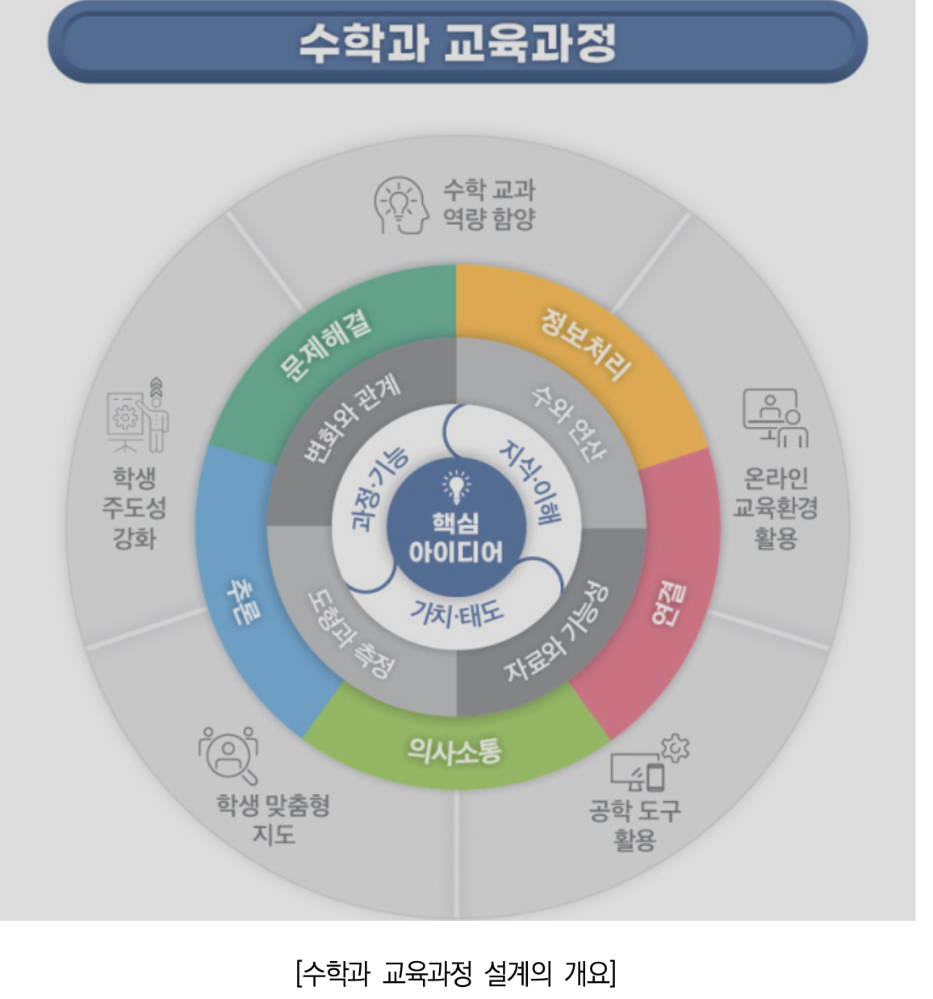
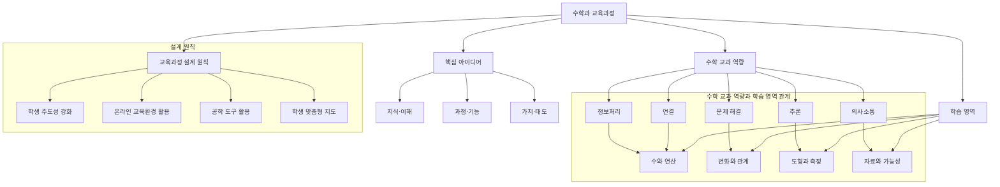

### **교육과정 설계의 개요 정리**

1. **미래 사회 대비 및 핵심 역량 강화**

    - 변화하는 교육 환경과 국가·사회적 요구를 반영하여, **‘포용성과 창의성을 갖춘 주도적인 사람’**을 육성하는 것이 목표입니다.
    - 학생의 삶과 성장을 지원하며, **자기관리, 정보처리, 창의적 사고, 심미적 감성, 협력적 소통, 공동체 역량**을 중점적으로 기릅니다.
    - 기초 소양(수리 소양, 디지털 소양, 언어 소양) 함양을 강조합니다.

2. **수학 교육과정의 핵심 방향**

    - 수학 교과의 핵심 역량으로 **문제해결, 추론, 의사소통, 연결, 정보처리**를 설정합니다.
    - 교육 내용은 **핵심 아이디어, 지식·이해, 과정·기능, 가치·태도**의 세 가지 범주로 구성됩니다.
    - 이를 통해 학생들이 수학적 사고력을 기르고, 실생활 및 다양한 학문 분야에서 수학을 활용할 수 있도록 합니다.

3. **교수·학습 및 평가 전략**

    - 학생 주도적 학습을 지원하고, 온라인 교육 환경에서도 효과적인 교수·학습 및 평가가 가능하도록 설계합니다.
    - 기초 소양 함양과 더불어 **생태 전환 교육, 민주 시민 교육, 학생 맞춤형 교육**을 포함한 교수·학습 및 평가 방법을 제시합니다.

4. **고등학교 수학 과목 체계**
    - 고등학교 수학 과목은 **공통 과목, 일반 선택 과목, 진로 선택 과목, 융합 선택 과목**으로 구성됩니다.
    - 공통 과목: 고등학교 수학 학습의 기초를 형성
    - 일반 선택 과목: 수학의 주요 학문적 내용을 학습
    - 진로 선택 과목: 특정 진로와 관련된 심화 학습 제공
    - 융합 선택 과목: 수학과 타 학문을 융합한 응용 학습 제공
    - **기본수학1·2**는 공통수학1·2를 대체할 수 있는 공통 과목으로 설계됨.

이와 같은 구조를 통해, 학생들이 수학적 역량을 기르고 다양한 진로 및 학문 분야에서 수학을 효과적으로 활용할 수 있도록 합니다.

**버전: 교육부 고시 제2022-33호 [별책 8] (최신 기준)**

### **총론의 핵심역량 정리**

총론에서는 교육과정이 목표로 하는 **핵심역량**을 설정하여, 미래 사회에서 학생들이 갖춰야 할 역량을 강조하고 있습니다. 이는 다음과 같이 구성됩니다.

---

### **1. 자기관리 역량**

-   자신의 삶을 스스로 계획하고 실천하는 능력
-   목표를 설정하고 지속적으로 노력하여 성취하는 태도 함양
-   정서 조절과 신체·정신 건강을 유지하며 자기 계발을 지속하는 능력

---

### **2. 지식정보처리 역량**

-   다양한 자료와 정보를 효과적으로 탐색, 분석, 활용하는 능력
-   정보와 데이터를 논리적으로 조직하고 이를 문제 해결에 적용하는 능력
-   디지털 기술을 포함한 다양한 도구를 활용하여 학습 및 의사결정을 지원하는 역량

---

### **3. 창의적 사고 역량**

-   문제를 새롭고 독창적인 방법으로 해결하는 능력
-   기존의 지식과 새로운 아이디어를 융합하여 혁신적인 해결책을 도출하는 능력
-   열린 사고방식과 도전정신을 가지고 새로운 방식으로 접근하는 태도

---

### **4. 심미적 감성 역량**

-   자연, 문화, 예술 등에서 아름다움을 느끼고 표현하는 능력
-   자신의 감정을 이해하고 타인의 감정을 공감하는 능력
-   창의적인 사고와 표현을 통해 자신과 사회를 풍요롭게 만드는 역량

---

### **5. 협력적 소통 역량**

-   다양한 배경을 가진 사람들과 효과적으로 의사소통하는 능력
-   경청과 존중을 바탕으로 다양한 의견을 조율하는 태도
-   협업을 통해 공동의 목표를 달성하는 능력

---

### **6. 공동체 역량**

-   지역, 국가, 세계 공동체의 일원으로서 책임감을 가지는 능력
-   인간과 환경의 지속 가능한 발전을 고려한 의사결정 능력
-   민주 시민으로서 다양성을 존중하고 공익을 실현하는 태도

---

이러한 핵심역량을 바탕으로 교육과정이 설계되었으며, 특히 수학 교육과정에서는 **문제해결, 추론, 의사소통, 연결, 정보처리**의 다섯 가지 교과 역량과 연계하여 운영됩니다.

**버전: 교육부 고시 제2022-33호 [별책 8] (최신 기준)**

### **수학 교과의 역량 정리**

수학 교과에서는 총론의 핵심역량과 연계하여, **문제해결, 추론, 의사소통, 연결, 정보처리**의 다섯 가지 역량을 핵심 교과 역량으로 설정하였습니다. 이 역량들은 학생들이 수학을 학습하면서 기르게 되는 핵심적인 능력을 의미합니다.

---

### **1. 문제해결 역량**

-   수학적 개념, 원리, 법칙을 활용하여 다양한 문제를 해결하는 능력
-   문제 상황을 분석하고 적절한 해결 전략을 수립 및 실행하는 능력
-   문제 해결 과정을 반성하고, 해결 전략을 개선하는 능력
-   새로운 문제를 창의적으로 변형하거나 해결하는 능력

✅ **예시:**

-   일상생활에서 발생하는 수량적 문제를 수학적으로 분석하여 해결하기
-   여러 가지 해결 방법을 비교하고 최적의 방법을 선택하기
-   복잡한 문제를 작은 문제로 나누어 해결하는 경험을 통해 논리적 사고력 향상

---

### **2. 추론 역량**

-   논리적으로 사고하고, 수학적 사실을 정당화하는 능력
-   가정을 설정하고 그에 따라 결론을 도출하는 능력
-   관찰과 실험을 통해 수학적 패턴과 규칙을 발견하고 이를 일반화하는 능력

✅ **예시:**

-   수학적 명제를 참이라고 주장할 때 논리적인 근거를 제시하고 설명하기
-   도형의 성질을 유추하여 삼각형의 내각 합이 180도임을 설명하기
-   실생활 문제를 귀납적·연역적 추론을 통해 분석하고 결론 도출

---

### **3. 의사소통 역량**

-   수학적 아이디어를 다양한 방식(기호, 그래프, 표, 언어 등)으로 표현하는 능력
-   다른 사람의 수학적 표현을 이해하고 해석하는 능력
-   수학적 사고 과정과 해결 방법을 논리적으로 설명하고 토론하는 능력

✅ **예시:**

-   수학적 개념을 정리하여 글로 표현하거나 수학적 논증을 작성하기
-   그래프나 수식을 활용하여 정보를 명확하게 전달하기
-   다른 사람의 풀이 과정을 분석하고 자신의 생각을 논리적으로 설명하기

---

### **4. 연결 역량**

-   수학의 개념과 원리를 서로 연결하여 학습하는 능력
-   실생활 및 타 교과의 개념과 수학을 연계하여 활용하는 능력
-   다양한 맥락에서 수학을 적용하여 문제를 해결하는 능력

✅ **예시:**

-   확률과 통계를 활용하여 사회현상(예: 선거 결과 예측, 경제 동향 분석)을 해석하기
-   피타고라스 정리를 활용하여 건축 및 공학 문제 해결
-   함수 개념을 활용하여 과학(물리, 화학) 및 경제(금융, 투자) 분야에 적용

---

### **5. 정보처리 역량**

-   자료와 정보를 수집, 정리, 분석하여 유의미한 결론을 도출하는 능력
-   수학적 개념을 디지털 도구(계산기, 컴퓨터 소프트웨어 등)를 활용하여 시각화하는 능력
-   공학 도구 및 ICT를 활용하여 수학적 분석을 수행하는 능력

✅ **예시:**

-   엑셀, 파이썬, R과 같은 프로그램을 활용하여 통계 데이터를 분석하고 시각화
-   기하 도구(Geogebra, Desmos 등)를 활용하여 도형을 그리거나 함수의 그래프를 해석
-   빅데이터를 분석하여 패턴을 찾고 의사결정에 활용

---

이 다섯 가지 역량은 수학 학습을 통해 학생들이 실생활 문제를 해결하고, 창의적이고 논리적인 사고를 기를 수 있도록 지원하는 핵심 요소입니다.

**버전: 교육부 고시 제2022-33호 [별책 8] (최신 기준)**

### **수학 교과 역량과 총론 핵심역량의 연계 정리**

수학 교과의 **5가지 핵심 역량**(문제해결, 추론, 의사소통, 연결, 정보처리)은 총론에서 제시하는 **6가지 핵심역량**(자기관리, 지식정보처리, 창의적 사고, 심미적 감성, 협력적 소통, 공동체 역량)과 연계되어 있습니다. 이를 쉽게 정리하면 다음과 같습니다.

---

### **1. 문제해결 역량 ↔ 창의적 사고 역량, 지식정보처리 역량**

**✔ 의미:**

-   문제를 다양한 방식으로 해결하며 창의적 사고력을 키우고, 새로운 해결 방법을 탐색할 수 있도록 합니다.
-   실생활의 다양한 문제를 수학적으로 분석하고 해결하는 능력을 기릅니다.

**💡 예시:**

-   실생활에서 최적의 금융 상품을 선택하기 위해 수학적 모델을 적용하기
-   여러 가지 풀이 방법을 비교하며 창의적인 해결 전략을 탐색하기

---

### **2. 추론 역량 ↔ 창의적 사고 역량, 지식정보처리 역량**

**✔ 의미:**

-   논리적으로 사고하고 수학적 명제를 증명하며, 비판적 사고력을 키웁니다.
-   귀납적, 연역적 사고를 통해 올바른 결론을 도출하는 능력을 배양합니다.

**💡 예시:**

-   삼각형의 내각 합이 180도임을 귀납적으로 탐색하고 연역적으로 증명하기
-   주어진 데이터를 분석하고 논리적으로 정당화하여 예측 모델을 만들기

---

### **3. 의사소통 역량 ↔ 협력적 소통 역량, 심미적 감성 역량**

**✔ 의미:**

-   수학적 표현(기호, 그래프, 표 등)을 활용하여 자신의 생각을 명확하게 전달하는 능력을 기릅니다.
-   토론과 협력을 통해 수학적 사고를 확장하고, 다양한 관점을 수용할 수 있도록 합니다.

**💡 예시:**

-   수학적 개념을 글로 표현하고 논리적으로 발표하기
-   수학적 근거를 바탕으로 의사결정을 내리고, 이를 타인과 효과적으로 공유하기

---

### **4. 연결 역량 ↔ 공동체 역량, 창의적 사고 역량**

**✔ 의미:**

-   수학을 실생활 및 타 교과와 연계하여 적용할 수 있는 능력을 함양합니다.
-   수학을 활용하여 사회적 문제를 분석하고, 창의적으로 해결할 수 있도록 합니다.

**💡 예시:**

-   환경 문제 해결을 위한 수학적 모델링(탄소 배출량 분석, 지속 가능한 에너지 계산)
-   금융과 경제 개념(복리, 세금, 통계 분석)을 활용하여 개인 재무 관리하기

---

### **5. 정보처리 역량 ↔ 지식정보처리 역량, 자기관리 역량**

**✔ 의미:**

-   데이터를 수집, 분석, 정리하고, 디지털 도구를 활용하여 문제를 해결하는 능력을 기릅니다.
-   정보 분석을 통해 논리적 의사결정을 내릴 수 있도록 합니다.

**💡 예시:**

-   엑셀이나 프로그래밍을 활용하여 통계 데이터를 분석하고 시각화하기
-   수학 소프트웨어(Geogebra, Desmos 등)를 활용하여 함수 그래프를 해석하기

---

### **정리: 총론 핵심역량과 수학 교과 역량의 관계**

| **총론 핵심역량** | **연계되는 수학 교과 역량**             |
| ----------------- | --------------------------------------- |
| 자기관리 역량     | 정보처리 역량                           |
| 지식정보처리 역량 | 문제해결 역량, 추론 역량, 정보처리 역량 |
| 창의적 사고 역량  | 문제해결 역량, 추론 역량, 연결 역량     |
| 심미적 감성 역량  | 의사소통 역량                           |
| 협력적 소통 역량  | 의사소통 역량                           |
| 공동체 역량       | 연결 역량                               |

---

### **결론**

수학 교과의 **5가지 역량**은 단순한 수학 지식 습득을 넘어, **논리적 사고력, 문제 해결 능력, 협력적 태도, 정보 분석 능력, 창의적 적용력** 등을 기를 수 있도록 설계되었습니다. 이는 미래 사회에서 학생들이 다양한 문제를 해결하고, 새로운 가치를 창출할 수 있도록 돕는 중요한 역할을 합니다.

**📌 핵심 요약:**

-   수학적 사고력 = 창의적 문제 해결 및 논리적 사고
-   수학적 의사소통 = 협력과 소통 능력 향상
-   수학적 연결 = 실생활 및 타 학문과의 연계 강화
-   수학적 정보처리 = 디지털 도구 활용 및 분석력 강화

이러한 구조를 통해, 수학 학습이 단순한 계산 능력을 넘어 **미래 사회에 필요한 핵심 역량을 기르는 과정**이 되도록 설계되었습니다.

**📌 버전: 교육부 고시 제2022-33호 [별책 8] (최신 기준)**

### **1. 기초 소양 내용 정리**

기초 소양은 학생들이 기본적으로 갖춰야 할 능력으로, 수학 학습을 통해 함양할 수 있는 핵심적인 요소입니다. 기초 소양은 **수리 소양, 디지털 소양, 언어 소양**의 세 가지로 나뉩니다.

#### **(1) 수리 소양**

-   수학적 개념과 원리를 이해하고 논리적으로 사고하는 능력
-   일상생활과 다양한 학문 분야에서 수학을 활용할 수 있는 능력
-   데이터 분석, 통계 해석, 도형 및 공간 감각 등의 수학적 사고력 포함

✅ **예시:**

-   금융, 과학, 공학 등에서 수학적 계산과 문제 해결 능력을 활용
-   확률과 통계를 이용한 데이터 해석 및 의사결정

#### **(2) 디지털 소양**

-   디지털 도구를 활용하여 데이터를 분석하고 시각화하는 능력
-   알고리즘적 사고를 기반으로 문제를 논리적으로 해결하는 능력
-   컴퓨터 프로그래밍, 코딩, 공학 소프트웨어 활용 능력 포함

✅ **예시:**

-   엑셀, 파이썬을 이용한 데이터 분석 및 시각화
-   공학 도구(Geogebra, Desmos 등)를 활용한 함수 그래프 해석

#### **(3) 언어 소양**

-   수학적 아이디어를 다양한 방법(기호, 그래프, 언어 등)으로 표현하는 능력
-   다른 사람의 수학적 표현을 이해하고 논리적으로 설명하는 능력
-   의사소통을 통해 수학적 사고를 확장하고 협력적 문제 해결을 도모하는 능력

✅ **예시:**

-   수학적 논리 구조를 명확하게 표현하여 문제를 해결하고 발표
-   팀 프로젝트에서 수학적 분석 결과를 효과적으로 공유

---

### **2. 총론 핵심역량과 수학 교과 역량 및 기초 소양과의 관계 정리**

수학 교과의 5가지 역량(문제해결, 추론, 의사소통, 연결, 정보처리)은 **총론의 6가지 핵심역량**과 연계되며, 이를 통해 기초 소양(수리 소양, 디지털 소양, 언어 소양)을 효과적으로 함양할 수 있습니다.

| **총론 핵심역량** | **수학 교과 역량**                      | **연계되는 기초 소양** |
| ----------------- | --------------------------------------- | ---------------------- |
| 자기관리 역량     | 정보처리 역량                           | 디지털 소양            |
| 지식정보처리 역량 | 문제해결 역량, 추론 역량, 정보처리 역량 | 수리 소양, 디지털 소양 |
| 창의적 사고 역량  | 문제해결 역량, 추론 역량, 연결 역량     | 수리 소양              |
| 심미적 감성 역량  | 의사소통 역량                           | 언어 소양              |
| 협력적 소통 역량  | 의사소통 역량                           | 언어 소양              |
| 공동체 역량       | 연결 역량                               | 수리 소양, 디지털 소양 |

---

### **3. 총론 핵심역량 – 수학 교과 역량 – 기초 소양의 연결**

**✔ ① 자기관리 역량 → 정보처리 역량 → 디지털 소양**

-   학생들이 디지털 도구를 활용하여 데이터를 분석하고 문제를 해결하는 능력을 기름.
-   자기주도적으로 디지털 기술을 활용하여 학습을 수행하고, 계산 및 시뮬레이션을 통해 문제를 해결하는 능력 포함.

**💡 예시:**

-   프로그래밍을 활용한 수학적 문제 해결
-   복잡한 계산을 공학 도구(엑셀, R, 파이썬)로 처리

---

**✔ ② 지식정보처리 역량 → 문제해결 역량, 추론 역량, 정보처리 역량 → 수리 소양, 디지털 소양**

-   수학적 원리를 이해하고 이를 활용하여 논리적으로 문제를 해결하는 능력 함양.
-   수학적 모델을 구성하여 실생활 문제를 해결하는 과정에서 데이터 분석 및 정보처리를 수행하는 능력 포함.

**💡 예시:**

-   확률과 통계를 이용한 경제·사회 문제 분석
-   기하학적 원리를 활용한 건축 설계

---

**✔ ③ 창의적 사고 역량 → 문제해결 역량, 추론 역량, 연결 역량 → 수리 소양**

-   수학적 개념을 창의적으로 적용하여 다양한 문제를 해결하는 능력을 기름.
-   새로운 방식으로 문제를 접근하고, 수학적 개념을 확장하여 응용할 수 있도록 함.

**💡 예시:**

-   수학적 패턴을 발견하여 알고리즘을 설계하는 능력
-   함수 개념을 활용하여 물리학적 현상 모델링

---

**✔ ④ 심미적 감성 역량 → 의사소통 역량 → 언어 소양**

-   수학적 개념을 다양한 형태(기호, 그래프, 언어)로 표현하고 논리적으로 전달하는 능력 함양.
-   수학의 아름다움을 이해하고 이를 통해 창의적 사고를 확장하는 능력 포함.

**💡 예시:**

-   도형의 대칭성과 패턴을 활용한 예술적 표현
-   수학적 논증을 글로 정리하고 발표하는 능력

---

**✔ ⑤ 협력적 소통 역량 → 의사소통 역량 → 언어 소양**

-   수학적 문제를 협력적으로 해결하고 논리적으로 토론할 수 있는 능력 함양.
-   다양한 사람들과 수학적 개념을 공유하고, 팀워크를 통해 문제를 해결하는 능력 포함.

**💡 예시:**

-   수학 토론을 통해 다양한 풀이법을 탐색
-   그룹 프로젝트에서 데이터 분석 결과를 효과적으로 공유

---

**✔ ⑥ 공동체 역량 → 연결 역량 → 수리 소양, 디지털 소양**

-   수학을 실생활 및 타 교과와 연결하여 활용하는 능력 함양.
-   환경, 경제, 공학 등의 다양한 분야에서 수학을 활용하여 실질적인 문제를 해결하는 능력 포함.

**💡 예시:**

-   기후변화 데이터 분석을 통해 지속 가능한 정책 제안
-   인공지능 수학을 활용하여 머신러닝 모델 개발

---

### **4. 정리 및 결론**

-   **총론의 핵심역량**(자기관리, 지식정보처리, 창의적 사고, 심미적 감성, 협력적 소통, 공동체 역량)은 **수학 교과의 5가지 역량**(문제해결, 추론, 의사소통, 연결, 정보처리)과 밀접하게 연계됨.
-   **수리 소양, 디지털 소양, 언어 소양**은 수학 학습을 통해 자연스럽게 함양되며, 미래 사회에서 필수적인 역량으로 작용.
-   수학 교과 역량을 강화함으로써 학생들은 **실제 문제 해결 능력, 창의적 사고력, 논리적 의사소통 능력**을 기르게 되며, 이는 총론의 교육 목표와 일치함.

✅ **결론:**  
수학 교육은 단순한 계산 능력을 넘어 **논리적 사고, 창의적 문제 해결, 디지털 활용 능력, 의사소통 역량**을 종합적으로 강화하는 역할을 하며, 이는 총론에서 제시하는 미래 교육 방향과 긴밀히 연결됨.

📌 **버전: 교육부 고시 제2022-33호 [별책 8] (최신 기준)**

### **수학과 교육과정의 설계 개요 정리**

1. **총론 핵심 역량과의 연계**

    - 수학과 교육과정은 **총론의 핵심 역량**과 연계하여,  
      **‘문제해결, 추론, 의사소통, 연결, 정보처리’**의 **5가지 수학 교과 역량**을 설정.
    - 이를 통해 학생들이 수학을 학습하면서 **논리적 사고력과 실생활 적용 능력**을 기를 수 있도록 설계.

2. **내용 체계 구성**

    - 수학 학습 내용을 **핵심 아이디어, 지식⋅이해, 과정⋅기능, 가치⋅태도**의 세 가지 범주로 나누어 체계적으로 구성.
    - 학생들이 단순한 지식 습득을 넘어, **문제 해결력과 수학적 태도**를 기를 수 있도록 유도.

3. **기초 소양 및 융합 교육 강화**

    - **기초 소양(수리 소양, 디지털 소양, 언어 소양) 함양**을 강조하여, 학생들이 다양한 분야에서 수학을 활용할 수 있도록 지원.
    - **생태전환 교육, 민주 시민 교육, 학생 맞춤형 교육**을 반영하여, 수학이 **사회적 문제 해결 및 미래 사회 대비**에 기여할 수 있도록 설계.

4. **학생 주도적 학습 및 평가 체계 도입**
    - **학생 주도성 개념을 강화**하여, 학생들이 스스로 학습 목표를 설정하고 성장할 수 있도록 지원.
    - **온라인 교육 환경에서도 효과적인 교수⋅학습 및 평가**가 가능하도록 체계적인 방안을 마련.

📌 **요약:**  
수학 교육과정은 총론의 핵심 역량과 연계하여 **5가지 수학 교과 역량(문제해결, 추론, 의사소통, 연결, 정보처리)**을 설정하고,  
**핵심 아이디어, 지식⋅이해, 과정⋅기능, 가치⋅태도**의 세 범주로 학습 내용을 체계화하여,  
**학생 주도 학습, 기초 소양 함양, 생태전환 및 민주 시민 교육, 맞춤형 교육**을 지원하는 방식으로 설계됨.

**📌 버전: 교육부 고시 제2022-33호 [별책 8] (최신 기준)**

### **수학과 교육과정 구성 요소 정리**

1. **구성 요소**

    - 수학과 교육과정은 **성격, 목표, 내용 체계, 성취기준, 교수⋅학습, 평가**로 구성됨.

2. **성격**

    - 수학 교과의 **고유한 특성 및 학습 필요성**을 제시.

3. **목표**

    - **총괄 목표:**
        - **지식⋅이해, 과정⋅기능, 가치⋅태도의 통합적 학습**을 통해 수학 교과 역량을 함양하는 것.
    - **세부 목표:**
        - **문제해결, 추론, 의사소통, 연결, 정보처리** 역량을 각각 강화하는 것을 목표로 설정.

4. **내용 체계**

    - 수학 학습 내용을 **영역별 핵심 아이디어, 지식⋅이해, 과정⋅기능, 가치⋅태도의 세 범주**로 구성.

5. **성취기준**

    - 학생이 도달해야 할 **구체적인 성취 수준을 제시**.
    - **성취기준 해설 및 적용 고려 사항**을 통해 성취기준의 취지, 범위, 적용 시 유의사항 제공.

6. **교수⋅학습 및 평가**
    - **수학 교과 역량 및 총론 개정 방향**을 반영하여 교수⋅학습 및 평가의 방향과 방법을 제시.
    - 다양한 교수⋅학습 전략을 활용하여 학생들의 수학적 사고력과 문제해결 능력을 함양하도록 설계.

📌 **요약:**  
수학 교육과정은 **성격, 목표, 내용 체계, 성취기준, 교수⋅학습, 평가**로 구성되며,  
**총론의 핵심 역량과 연계하여 문제해결, 추론, 의사소통, 연결, 정보처리 역량을 강화**하는 방향으로 설계됨.  
또한, **구체적인 성취기준 및 적용 고려 사항을 제시하여 효과적인 교수⋅학습과 평가를 지원**하도록 구성됨.

📌 **버전: 교육부 고시 제2022-33호 [별책 8] (최신 기준)**

## **총론 핵심역량 – 수학 교과 역량 – 기초 소양의 관계 및 추가 연계 내용 정리**

수학과 교육과정은 **총론의 핵심역량과 연계**하여 **문제해결, 추론, 의사소통, 연결, 정보처리**의 **5가지 수학 교과 역량**을 설정하였으며, 이를 통해 **기초 소양(수리 소양, 디지털 소양, 언어 소양)**을 함양하도록 설계되었습니다.

---

### **1. 총론 핵심역량과 수학 교과 역량 및 기초 소양의 관계 정리**

| **총론 핵심역량**     | **연계되는 수학 교과 역량**             | **관련 기초 소양**     | **설명**                                                       |
| --------------------- | --------------------------------------- | ---------------------- | -------------------------------------------------------------- |
| **자기관리 역량**     | 정보처리 역량                           | 디지털 소양            | - 자기주도적으로 디지털 도구를 활용하여 학습 및 문제 해결 수행 |
| **지식정보처리 역량** | 문제해결 역량, 추론 역량, 정보처리 역량 | 수리 소양, 디지털 소양 | - 수학적 모델을 구성하여 실생활 문제 해결 및 데이터 분석 수행  |
| **창의적 사고 역량**  | 문제해결 역량, 추론 역량, 연결 역량     | 수리 소양              | - 수학적 개념을 창의적으로 적용하여 다양한 문제 해결           |
| **심미적 감성 역량**  | 의사소통 역량                           | 언어 소양              | - 수학적 아이디어를 표현하고, 논리적으로 전달하는 능력         |
| **협력적 소통 역량**  | 의사소통 역량                           | 언어 소양              | - 수학적 개념을 공유하고 협력적으로 문제 해결                  |
| **공동체 역량**       | 연결 역량                               | 수리 소양, 디지털 소양 | - 수학을 실생활 및 타 교과와 연결하여 활용                     |

---

### **2. 총론 핵심역량 – 수학 교과 역량 – 기초 소양의 연결 상세 설명**

#### **① 자기관리 역량 → 정보처리 역량 → 디지털 소양**

-   **설명**: 학생이 디지털 도구를 활용하여 데이터를 분석하고 문제를 해결하는 능력을 기름.
-   **예시**:
    -   프로그래밍을 활용한 수학적 문제 해결 (예: Python을 활용한 함수 그래프 분석)
    -   복잡한 계산을 엑셀, R, MATLAB 등의 공학 도구로 처리

---

#### **② 지식정보처리 역량 → 문제해결 역량, 추론 역량, 정보처리 역량 → 수리 소양, 디지털 소양**

-   **설명**: 수학적 원리를 이해하고 실생활 문제를 해결하는 과정에서 데이터 분석 및 정보처리를 수행.
-   **예시**:
    -   통계를 활용한 경제·사회 문제 분석 (예: 선거 결과 예측, 인공지능 알고리즘의 확률적 접근)
    -   기하학적 원리를 활용한 건축 설계

---

#### **③ 창의적 사고 역량 → 문제해결 역량, 추론 역량, 연결 역량 → 수리 소양**

-   **설명**: 수학적 개념을 창의적으로 활용하고, 새로운 방식으로 문제를 접근하는 능력.
-   **예시**:
    -   인공지능 수학을 활용한 데이터 분석 및 최적화 모델 설계
    -   미적분 개념을 활용하여 경제학적 모델(공급-수요 곡선) 분석

---

#### **④ 심미적 감성 역량 → 의사소통 역량 → 언어 소양**

-   **설명**: 수학적 개념을 다양한 방식(기호, 그래프, 언어 등)으로 표현하고 논리적으로 전달.
-   **예시**:
    -   수학적 논리 구조를 명확하게 표현하여 문제를 해결하고 발표
    -   도형의 대칭성과 패턴을 활용한 예술적 표현

---

#### **⑤ 협력적 소통 역량 → 의사소통 역량 → 언어 소양**

-   **설명**: 수학적 문제를 협력적으로 해결하고 논리적으로 토론하는 능력.
-   **예시**:
    -   수학 토론을 통해 다양한 풀이법을 탐색
    -   팀 프로젝트에서 수학적 분석 결과를 효과적으로 공유

---

#### **⑥ 공동체 역량 → 연결 역량 → 수리 소양, 디지털 소양**

-   **설명**: 수학을 실생활 및 타 교과와 연결하여 활용하는 능력.
-   **예시**:
    -   기후변화 데이터를 수학적으로 분석하여 지속 가능한 정책 제안
    -   복잡한 네트워크 최적화(교통망, 통신망) 문제 해결

---

### **3. 추가적으로 연계되는 내용**

✅ **1) 수학과 타 교과의 융합**

-   **과학 (STEM 연계)**: 기하학과 물리학을 활용하여 로봇 공학 설계
-   **경제·경영**: 확률과 통계를 활용한 데이터 기반 투자 전략 분석
-   **인공지능 (AI 및 머신러닝)**: 미적분과 행렬을 활용하여 신경망 모델 학습

✅ **2) 수학과 실생활 연결**

-   **데이터 분석 및 인공지능 활용**: AI 모델의 확률적 예측과 최적화
-   **금융·경제**: 복리 계산, 대출 이자 분석을 통한 금융 리터러시 강화
-   **환경 및 지속 가능성**: 기후변화 데이터를 이용한 미래 예측 모델링

✅ **3) 미래 사회 대비 교육**

-   **디지털 시대의 필수 역량으로 수학 강조**
    -   빅데이터, AI, IoT(사물인터넷) 등의 기술을 이해하고 적용하는 데 필요한 수학적 사고력
    -   문제를 알고리즘적으로 해결하는 능력 (컴퓨팅 사고력)

✅ **4) 다양한 평가 방식 도입**

-   기존의 지필평가를 넘어 프로젝트 기반 평가, 포트폴리오 평가, 토론 평가 등을 활용하여 실생활 적용 능력 검증

---

### **4. 결론 및 정리**

-   수학 교육과정은 **총론의 핵심역량과 연계**하여 **문제해결, 추론, 의사소통, 연결, 정보처리 역량**을 강화하도록 설계됨.
-   수학 학습을 통해 **기초 소양(수리 소양, 디지털 소양, 언어 소양)**을 함양하며, 이를 통해 학생들은 미래 사회에서 필요로 하는 **논리적 사고력, 문제 해결 능력, 디지털 리터러시, 협력적 소통 능력** 등을 갖출 수 있음.
-   수학 교육은 **과학, 기술, 경제, 인공지능(AI), 환경 등의 다양한 분야와 융합**되어 실생활과 연계되며, 미래 사회에서의 필수 역량을 기르는 데 기여함.

📌 **버전: 교육부 고시 제2022-33호 [별책 8] (최신 기준)**

# **수학과 교육과정의 내용 체계 정리**

## **1. 수학과의 영역 구성**

-   **초·중학교 영역:**
    -   수학의 기본 개념과 원리를 다루는 **4개 영역**으로 구성
    -   초·중학교에서 동일한 영역을 설정하여 **연계성과 일관성 유지**
    -   학생들이 **핵심 개념을 반복·확장하여 학습**하도록 설계

| **영역**          | **설명**                                |
| ----------------- | --------------------------------------- |
| **수와 연산**     | 수의 개념, 사칙연산, 연산의 성질과 확장 |
| **변화와 관계**   | 수식, 방정식, 함수 개념 및 관계 탐구    |
| **도형과 측정**   | 도형의 성질, 측정 단위, 기하 개념 학습  |
| **자료와 가능성** | 통계, 확률 개념 이해 및 데이터 분석     |

-   **고등학교 연계:**
    -   초·중학교의 4개 영역은 **고등학교 수학의 공통 과목 및 선택 과목의 기초**가 됨.

---

## **2. 내용 체계 및 핵심 아이디어**

### **(1) 핵심 아이디어의 역할**

-   학년(군) 또는 학교급을 관통하는 **수학 개념의 본질 및 가치 제시**
-   수학 개념, 원리, 법칙의 **발생 과정, 확장, 일반화, 추상화**를 탐구하도록 유도
-   수평적·수직적으로 개념 간 **상호 연계성** 강조
-   학습 전이가 높은 내용으로 구성하여 **심화 학습 및 응용력 강화**

### **(2) 내용 체계 구성 요소**

내용 체계는 **지식⋅이해, 과정⋅기능, 가치⋅태도**의 세 가지 범주로 구성됨.

| **구성 요소** | **설명**                                                                                                                          |
| ------------- | --------------------------------------------------------------------------------------------------------------------------------- |
| **지식⋅이해** | - 수학의 핵심 개념, 원리, 법칙을 학년(군)별로 구분하여 제시   - 초·중학교에서는 위계성을 고려하여 학습 내용을 체계적으로 구성  |
| **과정⋅기능** | - 개념, 원리, 법칙을 학습할 때 **5가지 교과 역량(문제해결, 추론, 의사소통, 연결, 정보처리)**을 적용하여 사고 과정 강화            |
| **가치⋅태도** | - 수학 학습을 통해 학생들이 갖게 되는 태도와 실천적 성향을 포함   - 수학의 가치를 인식하고 수학적 태도를 함양할 수 있도록 설계 |

-   **성취기준 개발의 근거:**
    -   지식⋅이해, 과정⋅기능, 가치⋅태도를 바탕으로 성취기준이 설정됨.

---

## **3. 교육과정 활용 및 수업 계획**

### **(1) 수업 계획 시 교육과정 활용 절차**

1. **핵심 아이디어 파악**

    - 학습할 영역의 **핵심 개념 및 전체적인 흐름**을 이해
    - 영역 간 연계성과 학년별 확장성을 고려

2. **지식⋅이해, 과정⋅기능, 가치⋅태도 확인**

    - 수업에서 **중점적으로 다룰 개념 및 학습 목표 선정**

3. **성취기준 및 교수·학습 방법 구체화**

    - 성취기준 해설 및 적용 시 고려 사항 검토
    - 교수·학습 및 평가 방향을 설정하여 **수업의 효과성 극대화**

4. **핵심 아이디어와 성취기준의 연계 검토**
    - 수업 계획이 개별 성취기준 학습에만 그치지 않고,  
      **여러 성취기준을 아우르며 핵심 아이디어 형성에 기여하는지 점검 및 보완**

---

## **4. 결론 및 요약**

-   **초·중학교의 4개 영역(수와 연산, 변화와 관계, 도형과 측정, 자료와 가능성)**을 동일하게 설정하여  
    → **고등학교 수학 학습의 기초를 마련**
-   **핵심 아이디어**를 통해  
    → 수학 개념의 **발생·확장·연계·탐구 과정 강조**
-   **내용 체계(지식⋅이해, 과정⋅기능, 가치⋅태도)**를 통해  
    → **성취기준 설정 및 교수·학습 과정 설계**
-   **교육과정 활용 시**  
    → **핵심 아이디어와 성취기준을 연계하여 깊이 있는 학습을 유도**

📌 **버전: 교육부 고시 제2022-33호 [별책 8] (최신 기준)**

### **수학과 교육과정 설계 개요 정리**

해당 다이어그램은 **수학과 교육과정의 핵심 개념과 설계 원칙**을 시각적으로 표현한 것입니다. 이를 체계적으로 정리하면 다음과 같습니다.

---

## **1. 핵심 개념: ‘핵심 아이디어’를 중심으로 한 교육 체계**

-   **핵심 아이디어**:

    -   수학적 개념과 원리를 학습하는 데 있어 **본질적인 내용과 가치**를 강조하는 개념
    -   학년별·영역별로 연계하여 지속적으로 확장되는 학습 구조

-   **3가지 주요 요소**:
    1. **지식⋅이해**: 수학의 개념, 원리, 법칙을 이해하고 응용하는 능력
    2. **과정⋅기능**: 문제 해결 과정에서 수학적 사고를 적용하는 능력
    3. **가치⋅태도**: 수학적 태도 및 수학의 가치를 인식하는 능력

---

## **2. 수학 교과 역량과 4가지 핵심 영역**

수학 교과의 핵심 역량(문제해결, 추론, 의사소통, 연결, 정보처리)을 중심으로,  
**초·중·고 수학의 4개 핵심 영역**을 설정하여 연계 학습을 유도함.

| **수학 교과 역량** | **관련 학습 영역** | **설명**                                                        |
| ------------------ | ------------------ | --------------------------------------------------------------- |
| **문제 해결**      | 변화와 관계        | 수학적 개념과 원리를 활용하여 문제를 해결하는 능력              |
| **추론**           | 도형과 측정        | 논리적 사고를 바탕으로 수학적 개념을 정당화하고 발전시키는 능력 |
| **의사소통**       | 자료와 가능성      | 수학적 표현(기호, 그래프 등)을 활용하여 사고를 공유하는 능력    |
| **연결**           | 수와 연산          | 수학 개념 간 또는 타 학문과의 연계를 통해 사고를 확장하는 능력  |
| **정보처리**       | 수와 연산          | 디지털 도구를 활용하여 수학적 문제를 분석하고 해결하는 능력     |

---

## **3. 수학과 교육과정의 설계 원칙**

### **(1) 학생 주도성 강화**

-   학생이 스스로 학습 목표를 설정하고 문제 해결 과정을 탐색할 수 있도록 지원

### **(2) 온라인 교육환경 활용**

-   디지털 도구와 온라인 학습 자원을 활용한 수학 학습 지원

### **(3) 공학 도구 활용**

-   공학 계산기, 수학 소프트웨어, 시뮬레이션 등을 활용하여 개념을 시각화하고 탐구 과정 강화

### **(4) 학생 맞춤형 지도**

-   개인별 수준과 학습 속도를 고려한 차별화된 학습 지도 제공

---

## **4. 결론 및 요약**

-   **핵심 아이디어(지식⋅이해, 과정⋅기능, 가치⋅태도)**를 중심으로 학습 구조를 설계
-   **5가지 수학 교과 역량(문제해결, 추론, 의사소통, 연결, 정보처리)**을 반영하여  
    **4가지 핵심 영역(수와 연산, 변화와 관계, 도형과 측정, 자료와 가능성)** 학습
-   **학생 중심의 맞춤형 교육, 디지털 도구 활용, 온라인 학습 환경 구축**을 통해  
    **미래 사회에서 요구되는 수학적 사고력과 문제 해결 능력을 강화**

📌 **버전: 교육부 고시 제2022-33호 [별책 8] (최신 기준)**

다음은 **Mermaid 다이어그램**을 사용하여 **수학과 교육과정의 포함 관계**를 명확히 시각화한 것입니다.

---

### **다이어그램 구조 설명**

1. **최상위 개념: `수학과 교육과정(A)`**

    - **핵심 아이디어(B)** 포함 → `지식⋅이해(C)`, `과정⋅기능(D)`, `가치⋅태도(E)`를 포함
    - **수학 교과 역량(F)** 포함 → `문제해결(G)`, `추론(H)`, `의사소통(I)`, `연결(J)`, `정보처리(K)` 포함
    - **학습 영역(L)** 포함 → `수와 연산(M)`, `변화와 관계(N)`, `도형과 측정(O)`, `자료와 가능성(P)` 포함
    - **교육과정 설계 원칙(Q)** 포함 → `학생 주도성(R)`, `온라인 교육(S)`, `공학 도구(T)`, `맞춤형 지도(U)` 포함

2. **포함 관계를 명확하게 표현**
    - **`수학 교과 역량(F)`과 `학습 영역(L)`이 서로 연계됨**
    - **학습 영역(L)은 초·중·고 연계를 고려하여 구성됨**
    - **수업 설계 시 `핵심 아이디어(B)`를 기반으로 `수학 교과 역량(F)`이 반영됨**
    - **교육과정 설계 원칙(Q)은 학습 방향을 설정하는 중요한 요소로 포함됨**

---

### **개선된 점**

-   **포함관계를 명확하게 표현**
-   **수학 교과 역량과 학습 영역의 연결을 `subgraph`(서브그래프)로 표현하여 직관적으로 이해 가능**
-   **설계 원칙도 별도의 `subgraph`로 분리하여 학습 방향이 강조됨**

📌 **버전: 교육부 고시 제2022-33호 [별책 8] (최신 기준)**
