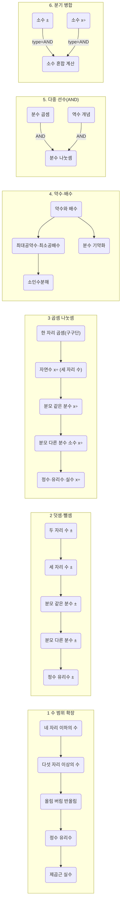

팀장님, 실제 교육과정에서는 **단순히 한 내용요소 → 다음 내용요소** 형태의 선형 위계뿐만 아니라, 여러 요소가 동시에 얽히거나(병렬 / 병합), 중복 선수요건을 갖추어야 하는 등 **복합적 관계**도 종종 나타납니다.

아래는 **‘수와 연산’** 영역에서 나올 수 있는 **복합적인 PREREQUISITE_FOR 관계** 예시와, 이를 그래프DB에서 어떻게 표현할 수 있는지에 대한 개념을 정리한 것입니다.

---

## 1. **다중 선수요건(Multiple Prerequisites) 관계**

어떤 학습 요소가 **두 가지 이상의 선수 학습**을 모두 이수해야 다음 단계로 나아갈 수 있는 경우입니다. 예를 들어,

-   **“분수의 나눗셈”** 학습을 위해서는
    -   _“분수의 곱셈”_
    -   _“역수(거꾸로 뒤집는 개념)”_  
        두 가지 개념을 모두 이해해야 함.

이 경우 그래프DB에서는 **‘분수의 곱셈’** 노드와 **‘역수 개념’** 노드에서 동시에 **“분수의 나눗셈”** 노드를 가리키도록 하고, 학습 로직에서는 두 노드가 모두 달성(achieved)되어야만 다음 노드(“분수의 나눗셈”)로 넘어갈 수 있도록 조건을 설정합니다.

> 예시 Cypher(개념적):
>
> ```cypher
> MATCH (mul:ContentElement {name: "분수의 곱셈"}),
>       (inv:ContentElement {name: "역수 개념"}),
>       (divf:ContentElement {name: "분수의 나눗셈"})
> CREATE (mul)-[:PREREQUISITE_FOR {type:"AND"}]->(divf),
>        (inv)-[:PREREQUISITE_FOR {type:"AND"}]->(divf);
> ```

`type:"AND"` 처럼 **속성**을 부여하여, “이 관계들은 **동시에** 충족되어야 한다”는 의미를 나타낼 수도 있습니다.

---

## 2. **분기(Branching) 관계**

어떤 하나의 내용 요소가, **여러 갈래**로 확장될 수 있는 경우입니다.  
예) **“약수와 배수”** 학습 후 →

-   (1) **최대공약수 / 최소공배수**로 연결
-   (2) **분수의 기약화나 통분** 등으로 이어지며
-   (3) 나아가 소인수분해와 정수 연산에까지 확장

즉 **하나의 선수 학습**이 여러 후속 노드들의 공통 토대가 되는 상황입니다.

> 예시 Cypher(개념적):
>
> ```cypher
> MATCH (ab:ContentElement {name: "약수와 배수"}),
>       (gcd_lcm:ContentElement {name: "최대공약수/최소공배수"}),
>       (reduce:ContentElement {name: "분수의 기약화/통분"}),
>       (factor:ContentElement {name: "소인수분해"})
> CREATE (ab)-[:PREREQUISITE_FOR]->(gcd_lcm),
>        (ab)-[:PREREQUISITE_FOR]->(reduce),
>        (ab)-[:PREREQUISITE_FOR]->(factor);
> ```

---

## 3. **병합(Merging) 관계**

반대로, 서로 다른 여러 갈래의 학습이 하나로 **병합**되어 새로운 학습 주제를 형성하기도 합니다.  
예) **“소수의 덧셈·뺄셈”** 과 **“소수의 곱셈·나눗셈”** 두 갈래가 모두 습득된 후 →

-   **“소수 혼합 계산”**으로 통합 활용
-   또는 “소수와 분수를 결합한 (실생활) 문제해결” 과 같은 병합된 주제로 확장

이 경우 그래프 상에서 **소수 덧셈·뺄셈 노드**와 **소수 곱셈·나눗셈 노드** 두 곳에서 동시에 **“소수 혼합 계산”**을 가리키도록 할 수 있습니다.

> 예시 Cypher(개념적):
>
> ```cypher
> MATCH (add_sub:ContentElement {name: "소수의 덧셈·뺄셈"}),
>       (mul_div:ContentElement {name: "소수의 곱셈·나눗셈"}),
>       (mixed:ContentElement {name: "소수 혼합 계산"})
> CREATE (add_sub)-[:PREREQUISITE_FOR {type:"AND"}]->(mixed),
>        (mul_div)-[:PREREQUISITE_FOR {type:"AND"}]->(mixed);
> ```
>
> 여기서도 `type:"AND"`같이 속성을 주면 “두 선행 내용이 모두 이수되어야 한다”는 의미를 표현할 수 있습니다.

---

## 4. **순환(Cycle)은 지양**

수학 내용 체계상, 보통 **한 단원 내용이 다시 이전 단원의 선수요건이 되는 식의 ‘순환’**은 발생하지 않습니다. 그러나

-   ‘나눗셈’ 과정에서 **곱셈** 개념이 필요하고, 곱셈에서 ‘덧셈의 반복’ 개념으로 설명하기도 하는 등 **논리적 설명상**으로는 조금 순환적으로 보일 수 있습니다.

하지만 **학습 위계** 측면에서는 “(덧셈) → 곱셈 → 나눗셈”으로 진행되는 흐름이 일반적이므로,

-   실제 선수학습 구조는 **일방향**으로 설계하고,
-   교과서에서는 이해를 돕기 위해 곱셈 = 동수누가(덧셈 반복) 형태로 설명하는 식입니다.

즉, 그래프 상에서 **PREREQUISITE_FOR** 관계를 **양방향**으로 연결하지 않도록 주의합니다.

---

## 5. **요약**: 실제 교과구조는 “나선형 + 분기 + 병합”

-   **나선형 심화**: 학년이 올라갈수록 범위 확대(자연수→정수→유리수→실수), 연산 난이도 상승
-   **분기**: 특정 선행 내용을 토대로 여러 갈래 후속 학습이 생김 (약수·배수 → 최대공약수/최소공배수, 소인수분해, 분수 기약화 등)
-   **병합**: 여러 갈래에서 학습한 내용을 통합·응용하는 고차원 주제 형성 (예: 분수·소수 각각의 연산 습득 후 혼합 계산)

이러한 **복합적인 학습 경로**를 그래프DB로 모델링할 때, `PREREQUISITE_FOR` 관계에 **(type, weight 등 속성)**을 부여하거나,  
별도 **중간 노드(AND/OR 게이트)**를 두는 방식으로 표현하시면, 단순 선형 구조보다 훨씬 유연한 학습 경로 추천이나 선수 학습 체크 로직을 구현할 수 있습니다.

---

### 결론

-   **복합적 PREREQUISITE_FOR 관계**란, 하나의 학습 요소가 여러 후속 요소로 “분기”되는 경우나, 여러 선수 요소가 동시에 필요한 “병합” 상황을 모두 포함합니다.
-   실제 수학 교육과정 위계를 **그래프**로 표현하면, 이런 **분기/병합/다중 선수요건** 형태가 다수 발견되며,
-   이를 바탕으로 **학생 맞춤형 학습 경로**, **개인별 취약 부분 진단** 등을 한층 체계적으로 운영할 수 있습니다.

**버전: 교육부 고시 제2022-33호 [별책 8] (최신 기준)**

팀장님, 다음은 **수와 연산** 영역의 **복합적인 PREREQUISITE_FOR 관계**를 간략히 시각화한 **Mermaid** 예시입니다.

-   여러 갈래로 **분기**되는 관계,
-   **여러 선수 요소**가 합쳐져야 후속 학습이 가능한 **병합(AND)** 구조,
-   학년군별 **위계**에 따른 확장을 모두 한 그림에 담으려 했습니다.
-   각 노드는 대표적인 내용 요소를 간단히 표기했으며, 실제 DB에서는 노드의 `id`, `name`, `category` 등을 더 상세하게 구성하시면 됩니다.

아래 코드 블록을 **Mermaid** 지원 환경(예: Markdown 뷰어, Mermaid Live Editor 등)에 붙여 넣으시면 다이어그램으로 확인할 수 있습니다.



### 다이어그램 설명

1. **1. 수 범위 확장**

    - _네 자리 이하의 수_ → _다섯 자리 이상의 수_ → _올림/버림/반올림_ → _정수/유리수_ → _제곱근·실수_
    - 학년 올라갈수록 자연수 범위를 확장하고, 중학교에서 정수·유리수·실수로 일반화

2. **2. 덧셈/뺄셈 확장**

    - _두 자리 수 ±_ → _세 자리 수 ±_ → (분모 동일) _분수 ±_ → (분모 다름) _분수 ±_ → _정수/유리수 ±_
    - 초등 중 · 고학년 단계에 따라 분수, 소수 연산이 추가되고, 중학교에서는 정수/유리수 범위까지 확장

3. **3. 곱셈/나눗셈 확장**

    - _한 자리 곱셈(구구단)_ → _자연수 x÷(세 자리 수)_ → (분모 동일) _분수 x÷_ → (분모 다른) _분수·소수 x÷_ → _정수/유리수/실수 x÷_

4. **4. 약수·배수**

    - _약수와 배수_ → _최대공약수·최소공배수_ & _분수 기약화_ → _소인수분해_
    - 한 개의 선수 요소(약수와 배수)가 여러 요소로 분기되는 구조

5. **5. 다중 선수(AND) 예시**

    - “분수의 나눗셈”을 학습하려면 *“분수 곱셈”*과 *“역수 개념”*을 모두 이해해야 하는 등 **AND** 구조

6. **6. 분기/병합 예시**
    - *소수 ±*와 *소수 x÷*를 모두 학습 완료해야 최종적으로 *“소수 혼합 계산”*을 다룰 수 있음
    - 두 갈래가 병합(AND)되어 하나의 후속 주제로 이어지는 구조

이처럼 **수와 연산** 영역 내 여러 내용 요소들이 **단선적 위계**(단순 선후 관계) 뿐 아니라,  
**분기**, **병합(AND)**, **다중 선수학습** 등 **복합적 구조**를 보이므로,  
Mermaid 다이어그램으로 시각화하면 **학습 경로**를 더욱 직관적으로 파악할 수 있습니다.

-   필요하시면 Mermaid 코드 내에서 **스타일, subgraph 배치** 등을 수정해주시면 됩니다.
-   또한 실제 **노드의 `id`**(예: DB상 `id: "CE-D02-...`)와 **내용**을 더 구체적으로 적절히 매핑하여 사용하시면 됩니다.

---

**버전: 교육부 고시 제2022-33호 [별책 8] (최신 기준)**
