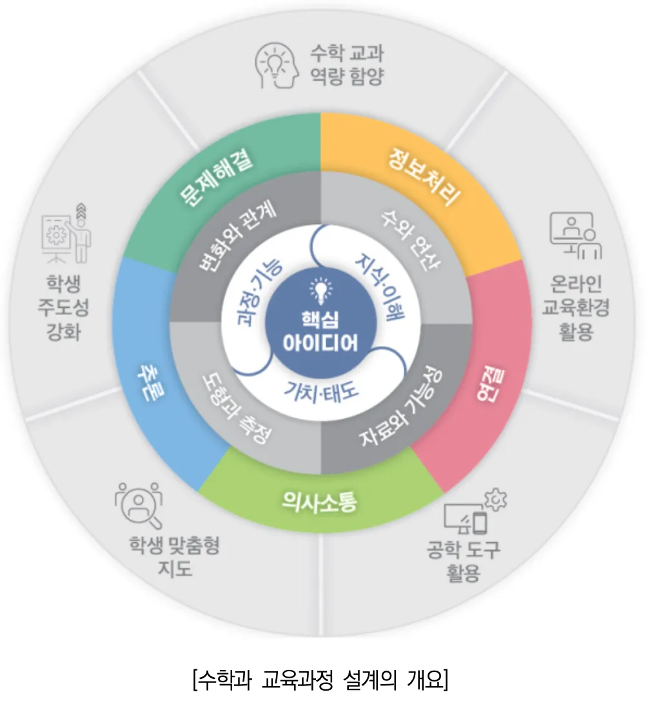

# 수학 교육과정 설계의 개요 분석

제시된 수학 교육과정 설계의 개요를 분석해보겠습니다. 이 내용은 크게 다음과 같은 핵심 요소와 관계로 구성되어 있습니다:

## 1. 총론과 수학과 교육과정의 연계

-   **인간상**: 총론에서는 "포용성과 창의성을 갖춘 주도적인 사람"이라는 인간상 제시
-   **핵심 역량**: 총론의 6가지 역량(자기 관리, 지식정보처리, 창의적 사고, 심미적 감성, 협력적 소통, 공동체)과 연계하여 수학과에서는 5가지 교과 역량 설정
-   **기초 소양**: 수리 소양, 디지털 소양, 언어 소양 강조

## 2. 수학과 교육과정의 구성 체계

-   **성격**: 수학과의 고유 특성과 학습 필요성
-   **목표**: 총괄 목표와 세부 목표로 구성

    -   총괄 목표: 지식·이해, 과정·기능, 가치·태도를 통합적으로 학습하여 수학 교과 역량 함양
    -   세부 목표: 5가지 수학 교과 역량(문제해결, 추론, 의사소통, 연결, 정보처리) 함양

-   **내용 체계**: 영역별 핵심 아이디어와 3가지 범주로 구성

    -   핵심 아이디어: 학년(군) 또는 학교급을 관통하는 수학 내용의 본질과 가치
    -   지식·이해: 수학의 핵심 개념, 원리, 법칙 등을 학년(군)별로 제시
    -   과정·기능: 5가지 교과 역량이 발현되는 사고 과정이나 기능
    -   가치·태도: 수학 학습을 통한 태도와 실천적 성향

-   **성취기준**: 구체적인 성취 내용 제시

    -   성취기준 해설: 성취기준의 취지, 범위 등 해석
    -   성취기준 적용 시 고려 사항: 적용 시 고려할 정보 제시

-   **교수·학습 및 평가**: 수학 교과 역량 및 총론의 개정 중점을 반영한 방향과 방법 제시

## 3. 수학과 영역 구성

-   초·중학교: 4개 영역으로 동일하게 구성

    -   수와 연산
    -   변화와 관계
    -   도형과 측정
    -   자료와 가능성

-   고등학교: 초·중학교 영역이 공통 과목이나 선택 과목의 기초가 됨

## 4. 수학 수업 계획 시 교육과정 활용 방법

1. 핵심 아이디어를 통해 영역을 아우르는 관점 파악
2. 내용 체계(지식·이해, 과정·기능, 가치·태도)의 중점 내용 확인
3. 성취기준, 성취기준 해설, 성취기준 적용 시 고려 사항, 교수·학습 및 평가를 확인하여 수업 내용과 방법 구체화
4. 여러 성취기준을 아우르는 핵심 아이디어 구성에 기여하는지 점검 및 보완

이 수학 교육과정은 학생의 삶과 성장을 지원하고, 미래 사회가 요구하는 역량을 함양하며, 학생 주도성 개념을 바탕으로 설계되었습니다. 특히 핵심 아이디어를 중심으로 지식·이해, 과정·기능, 가치·태도를 통합적으로 학습함으로써 수학 교과 역량을 효과적으로 기를 수 있도록 구성되어 있습니다.

# 수학과 교육과정의 목표 체계

## 총괄 목표

-   지식·이해, 과정·기능, 가치·태도를 **통합적으로 학습**하여 수학 교과 역량을 함양하는 것
-   이는 학생들이 수학의 개념적 이해와 절차적 능력을 바탕으로 수학적 사고력과 실천적 태도를 균형 있게 발달시키는 것을 의미

## 세부 목표

세부 목표는 5가지 수학 교과 역량을 각각 함양하는 것으로 설정:

1. **문제해결 역량** 함양

    - 수학적 지식과 사고 방법을 활용하여 문제를 해결하는 능력 개발

2. **추론 역량** 함양

    - 수학적 사실이나 명제의 타당성을 논리적으로 판단하고 이끌어내는 능력 개발

3. **의사소통 역량** 함양

    - 수학적 아이디어와 사고 과정을 표현하고 다른 사람과 공유하는 능력 개발

4. **연결 역량** 함양

    - 수학의 내적 연결성(개념 간, 영역 간)과 외적 연결성(다른 교과, 실생활)을 이해하고 활용하는 능력 개발

5. **정보처리 역량** 함양
    - 수학적 정보와 자료를 수집, 정리, 분석, 활용하는 능력 개발

이러한 목표 체계는 학생들이 단순한 지식 습득을 넘어서 수학적 사고력과 문제해결 능력을 갖추고, 수학의 가치를 인식하여 실생활과 다양한 분야에서 수학을 활용할 수 있는 역량을 기르는 데 초점을 맞추고 있습니다.

# 수학과 교육과정의 총괄목표와 세부목표의 연계성

## 총괄목표와 세부목표의 연계적 관계

총괄목표는 **지식·이해, 과정·기능, 가치·태도를 통합적으로 학습하여 수학 교과 역량을 함양**하는 것으로, 세부목표는 이 수학 교과 역량의 구체적 요소인 **5가지 개별 역량(문제해결, 추론, 의사소통, 연결, 정보처리)을 각각 함양**하는 것입니다. 이들의 연계성은 다음과 같습니다:

1. **구조적 연계성**

    - 총괄목표: 수학 교과 역량 전체의 통합적 함양을 지향
    - 세부목표: 5가지 개별 역량의 구체적 함양 방법을 제시
    - 관계: 세부목표는 총괄목표를 달성하기 위한 구체적인 하위요소로 기능

2. **교수·학습 측면의 연계성**

    - 총괄목표: 통합적 접근 방식을 강조(지식·이해, 과정·기능, 가치·태도의 통합)
    - 세부목표: 각 역량별 중점적인 교수·학습 방향 제시
    - 관계: 개별 역량 함양을 통해 궁극적으로 통합적 학습 경험 제공

3. **평가 측면의 연계성**

    - 총괄목표: 수학 교과 역량의 종합적 평가 지향
    - 세부목표: 각 역량별 구체적인 평가 요소와 방법 제시
    - 관계: 세부 역량별 평가가 모여 종합적인 수학 교과 역량 평가로 완성

4. **내용 체계와의 연계성**

    - 총괄목표: 내용 체계의 세 범주(지식·이해, 과정·기능, 가치·태도)와 직접 연결
    - 세부목표: 특히 과정·기능 범주에서 5가지 역량이 구체적으로 발현됨
    - 관계: 내용 체계와 목표 체계가 유기적으로 연결되어 일관된 교육과정 구성

5. **실행 과정의 연계성**
    - 총괄목표: 수학 수업과 평가의 전체적인 방향 제시
    - 세부목표: 수업과 평가의 구체적인 실행 방법 안내
    - 관계: 총괄목표가 지향점이 되고 세부목표가 실행 지침이 되는 상호보완적 관계

이러한 연계성을 통해 수학과 교육과정은 일관된 방향성을 가지고 학생들의 수학적 역량을 체계적으로 함양할 수 있도록 설계되어 있습니다. 총괄목표는 큰 그림을 제시하고, 세부목표는 그 그림을 완성하기 위한 구체적인 방법을 안내함으로써 교육과정의 일관성과 체계성을 확보하고 있습니다.

# 수학과 교육과정에서의 총괄목표와 세부목표의 구조적 연계성

## 구조적 연계성의 핵심 요소

수학과 교육과정의 총괄목표와 세부목표 간 구조적 연계성은 다음과 같은 핵심 요소를 중심으로 체계화되어 있습니다:

1. **위계적 구조**

    - 총괄목표는 상위 개념으로서 전체적인 방향성 제시
    - 세부목표는 하위 개념으로서 총괄목표를 구성하는 구체적 요소
    - 세부목표들의 통합적 달성이 총괄목표의 성취로 이어지는 구조

2. **구성 요소의 체계성**

    - 총괄목표: 지식·이해, 과정·기능, 가치·태도의 통합을 통한 수학 교과 역량 함양
    - 세부목표: 문제해결, 추론, 의사소통, 연결, 정보처리라는 5가지 구체적 역량 함양
    - 5가지 세부 역량은 총괄목표의 구성 요소로서 상호보완적 관계 형성

3. **수직적 연결 구조**

    - 총괄목표에서 세부목표로 이어지는 하향식(top-down) 연결
    - 세부목표의 달성이 총괄목표로 수렴되는 상향식(bottom-up) 연결
    - 양방향적 연결을 통한 교육 목표의 일관성과 체계성 확보

4. **수평적 통합 구조**

    - 5가지 세부 역량 간의 유기적 연결과 통합
    - 각 역량이 독립적으로 존재하면서도 상호 연결되어 총체적 수학 역량으로 발현
    - 세부 역량 간 상호작용을 통한 시너지 효과 창출

5. **실행적 체계성**
    - 총괄목표: 교육과정 설계 및 운영의 전체적 방향 설정
    - 세부목표: 구체적인 교수·학습 및 평가 방법 구현의 기준점 제공
    - 교육과정-교수법-평가가 일관된 체계로 연결되는 구조

이러한 구조적 연계성을 통해 수학과 교육과정은 명확한 목표 체계를 갖추고, 교육 현장에서의 실행력을 높이며, 학생들의 수학적 역량을 체계적으로 함양할 수 있는 기반을 마련하고 있습니다. 각 세부목표는 독립적으로 중요하면서도 궁극적으로는 하나의 통합된 총괄목표를 향해 정렬되어 있는 체계적 구조를 형성하고 있습니다.

# 수학과 교육과정에서의 총괄목표와 세부목표의 교수·학습 측면 연계성

## 교수·학습 측면의 연계성 구조

수학과 교육과정의 총괄목표와 세부목표는 교수·학습 측면에서 다음과 같은 연계성을 갖습니다:

1. **통합적 접근법과 개별 역량 강화의 연계**

    - 총괄목표: 지식·이해, 과정·기능, 가치·태도의 통합적 학습 접근 강조
    - 세부목표: 각 역량별 특화된 교수·학습 방법 제시
    - 연계성: 개별 역량 강화 활동이 모여 통합적 학습 경험으로 구성됨

2. **교수·학습 방법의 체계화**

    - 총괄목표: 수학 교육의 전체적인 교수·학습 방향 설정
    - 세부목표: 각 역량 함양을 위한 구체적인 교수·학습 전략 제공
    - 연계성: 교사가 총괄목표를 인식하면서 세부목표별 교수법 적용 가능

3. **학습 경험 설계의 일관성**

    - 총괄목표: 통합적 수학 역량 함양을 위한 학습 경험의 방향성 제시
    - 세부목표: 역량별 최적화된 학습 활동과 경험 설계 지침 제공
    - 연계성: 개별 학습 경험이 전체적인 수학 역량 함양으로 수렴

4. **학생 중심 학습의 구현**

    - 총괄목표: 학생의 삶과 성장 지원을 위한 학생 주도성 개념 강조
    - 세부목표: 각 역량 함양 과정에서 학생 주도적 참여 방법 구체화
    - 연계성: 다양한 역량 활동을 통해 학생 주도성이 종합적으로 발현

5. **맥락적 학습의 체계화**

    - 총괄목표: 실생활 및 다양한 맥락에서의 수학 학습 중요성 제시
    - 세부목표: 특히 '연결 역량'과 '문제해결 역량'에서 맥락적 학습 구체화
    - 연계성: 다양한 맥락을 통합하여 의미 있는 수학 학습 경험 창출

6. **교수·학습 자원 활용의 체계성**

    - 총괄목표: 디지털 소양 등 기초 소양 함양을 위한 자원 활용 방향 제시
    - 세부목표: '정보처리 역량' 등에서 구체적인 자원 활용 방법 안내
    - 연계성: 다양한 자원을 체계적으로 활용하여 종합적 역량 개발

7. **평가와 교수·학습의 연계**
    - 총괄목표: 통합적 역량 함양을 위한 평가와 교수·학습의 연계 강조
    - 세부목표: 각 역량별 평가 요소와 교수·학습 방법의 연계 구체화
    - 연계성: 평가가 학습의 과정으로 통합되는 체계적 구조 형성

이러한 교수·학습 측면의 연계성을 통해 수학과 교육과정은 교사들이 수업을 설계하고 실행할 때 총괄목표의 방향성을 유지하면서도 세부목표의 구체적인 지침을 활용할 수 있는 체계적인 틀을 제공합니다. 이는 학생들이 다양한 학습 경험을 통해 수학 교과 역량을 균형 있게 함양할 수 있도록 지원합니다.

# 수학과 교육과정에서의 총괄목표와 세부목표의 평가 측면 연계성

## 평가 측면의 연계성 구조

수학과 교육과정의 총괄목표와 세부목표는 평가 측면에서 다음과 같은 체계적인 연계성을 갖습니다:

1. **종합적 평가와 역량별 평가의 체계적 연계**

    - 총괄목표: 지식·이해, 과정·기능, 가치·태도의 통합적 평가 지향
    - 세부목표: 5가지 역량별 구체적인 평가 요소와 방법 제시
    - 연계성: 개별 역량 평가 결과가 통합되어 종합적 수학 교과 역량 평가로 완성됨

2. **평가 영역의 체계화**

    - 총괄목표: 수학 교과 역량의 균형 있는 평가 강조
    - 세부목표: 각 역량별 특성에 맞는 평가 영역 구체화
    - 연계성: 다양한 평가 영역이 상호보완적으로 작용하여 총체적 평가 실현

3. **평가 방법의 다양화 및 체계화**

    - 총괄목표: 통합적 역량 평가를 위한 다양한 평가 방법 활용 강조
    - 세부목표: 각 역량의 특성에 적합한 평가 방법 구체화
    - 연계성: 다양한 평가 방법이 유기적으로 결합하여 종합적 평가 체계 구성

4. **과정 중심 평가의 체계적 실행**

    - 총괄목표: 학생의 성장 과정을 지원하는 과정 중심 평가 강조
    - 세부목표: 특히 '문제해결', '추론', '의사소통' 역량에서 과정 중심 평가 구체화
    - 연계성: 각 역량별 과정 중심 평가가 총체적인 성장 평가로 통합됨

5. **평가 기준의 체계화**

    - 총괄목표: 수학 교과 역량 평가를 위한 전체적인 기준 방향 제시
    - 세부목표: 역량별 구체적인 평가 기준과 지표 제공
    - 연계성: 개별 평가 기준이 상호 연결되어 일관된 평가 체계 형성

6. **평가 결과 활용의 체계성**

    - 총괄목표: 평가 결과의 종합적 활용 방향 제시
    - 세부목표: 각 역량별 평가 결과의 구체적 활용 방법 안내
    - 연계성: 다양한 평가 결과가 통합되어 학생의 전인적 성장 지원에 활용

7. **자기 평가 및 메타인지 발달 지원**

    - 총괄목표: 학생 주도성 개념을 바탕으로 한 자기 평가 강조
    - 세부목표: 특히 '자기 관리' 역량과 연계된 자기 평가 방법 구체화
    - 연계성: 역량별 자기 평가가 통합되어 메타인지적 사고 발달 촉진

8. **형성 평가와 총괄 평가의 균형**
    - 총괄목표: 균형 있는 평가 체계를 통한 종합적 역량 평가 강조
    - 세부목표: 각 역량에 적합한 형성 평가와 총괄 평가 방법 제시
    - 연계성: 다양한 유형의 평가가 상호보완적으로 작용하여 통합적 평가 체계 구성

이러한 평가 측면의 연계성을 통해 수학과 교육과정은 학생들의 수학 교과 역량을 다양한 각도에서 균형 있게 평가하고, 그 결과를 학생의 성장을 지원하는 데 체계적으로 활용할 수 있는 틀을 제공합니다. 총괄목표가 제시하는 통합적 평가의 방향성과 세부목표가 제공하는 구체적인 평가 요소 및 방법이 유기적으로 연결됨으로써, 평가의 타당성과 신뢰성을 높이고 학생 중심의 교육을 실현하는 데 기여합니다.

# 수학과 교육과정에서의 총괄목표와 세부목표의 내용 체계와의 연계성

## 내용 체계와의 연계성 구조

수학과 교육과정의 총괄목표와 세부목표는 내용 체계와 다음과 같은 체계적인 연계성을 갖습니다:

1. **내용 체계의 세 범주와 목표의 직접적 연결**

    - 총괄목표: 지식·이해, 과정·기능, 가치·태도를 통합적으로 학습하여 수학 교과 역량 함양
    - 내용 체계: 지식·이해, 과정·기능, 가치·태도의 세 범주로 구성
    - 연계성: 총괄목표의 구성 요소와 내용 체계의 범주가 일대일 대응되는 구조

2. **핵심 아이디어와 목표의 연계**

    - 총괄목표: 수학 교과 역량의 통합적 함양 강조
    - 내용 체계: 핵심 아이디어는 학년(군) 또는 학교급을 관통하는 수학 내용의 본질 또는 가치 제시
    - 연계성: 핵심 아이디어가 총괄목표 달성을 위한 내용적 기반 제공

3. **지식·이해 범주와 목표의 연계**

    - 총괄목표: 지식·이해의 중요성 강조
    - 세부목표: 특히 '추론 역량'과 '연결 역량'에서 지식·이해의 활용 구체화
    - 내용 체계: 학년(군)별 핵심적인 개념, 원리, 법칙을 체계적으로 제시
    - 연계성: 내용 체계의 지식·이해가 목표 달성을 위한 기초 지식 제공

4. **과정·기능 범주와 세부목표의 직접적 연계**

    - 세부목표: 5가지 수학 교과 역량(문제해결, 추론, 의사소통, 연결, 정보처리) 함양
    - 내용 체계: 과정·기능 범주는 5가지 교과 역량이 발현되는 사고 과정이나 기능 제시
    - 연계성: 세부목표의 각 역량이 내용 체계의 과정·기능 범주에 직접 반영됨

5. **가치·태도 범주와 목표의 연계**

    - 총괄목표: 가치·태도 측면의 학습 강조
    - 세부목표: 각 역량 함양 과정에서의 태도적 측면 포함
    - 내용 체계: 수학 학습을 통해 갖게 되는 태도와 실천적 성향 제시
    - 연계성: 내용 체계의 가치·태도가 목표의 정의적 측면 달성 지원

6. **학년(군)별 위계성과 목표의 연계**

    - 총괄목표: 수학 교과 역량의 지속적 발달 강조
    - 내용 체계: 학년(군)에 따른 위계성을 가지며 구성
    - 연계성: 내용의 위계적 구성이 목표의 단계적 달성 지원

7. **영역 간 연결성과 목표의 연계**

    - 세부목표: 특히 '연결 역량'에서 영역 간 연결성 강조
    - 내용 체계: 영역 간 위계성과 연결성 고려하여 구성
    - 연계성: 내용 체계의 영역 간 연결이 통합적 역량 함양 지원

8. **성취기준과 목표의 연계**
    - 총괄목표와 세부목표: 수학 교과 역량 함양의 방향성 제시
    - 내용 체계: 성취기준 개발의 근거 제공
    - 연계성: 내용 체계의 세 범주가 성취기준으로 구체화되고, 이를 통해 목표 달성 지원

이러한 내용 체계와의 연계성을 통해 수학과 교육과정은 목표와 내용이 유기적으로 연결된 일관된 체계를 갖추게 됩니다. 이는 교사들이 교육과정을 실행할 때 목표와 내용을 통합적으로 이해하고 적용할 수 있게 하며, 학생들이 수학 학습을 통해 의미 있는 역량을 체계적으로 함양할 수 있도록 지원합니다. 특히 내용 체계의 세 범주가 총괄목표의 구성 요소와 직접 연결됨으로써, 학습 내용과 목표 간의 일관성과 연계성이 강화됩니다.

# 수학과 교육과정에서의 총괄목표와 세부목표의 실행 과정 연계성

## 실행 과정의 연계성 구조

수학과 교육과정의 총괄목표와 세부목표는 교육과정 실행 과정에서 다음과 같은 체계적인 연계성을 갖습니다:

1. **방향성과 구체성의 상호보완적 관계**

    - 총괄목표: 수학 교육의 전체적인 방향과 지향점 제시
    - 세부목표: 구체적인 실행 방법과 지침 제공
    - 연계성: 총괄목표가 큰 그림을 그리고 세부목표가 실행 단계를 안내하는 상호보완적 구조

2. **교육과정 설계-실행-평가의 일관성**

    - 총괄목표: 교육과정 설계의 기본 원칙과 방향 설정
    - 세부목표: 실행과 평가의 구체적인 기준점 제공
    - 연계성: 설계부터 평가까지 일관된 체계 속에서 실행 가능

3. **교사의 수업 계획과 실행 지원**

    - 총괄목표: 수업 계획의 전체적인 방향 제시
    - 세부목표: 각 역량별 구체적인 수업 활동과 방법 안내
    - 연계성: 교사가 큰 그림을 이해하면서 구체적인 수업을 설계하고 실행할 수 있는 체계 제공

4. **수학 수업 계획 단계별 연계**

    - 1단계(핵심 아이디어 파악): 총괄목표와 연계된 영역 전체의 관점 이해
    - 2단계(내용 체계 확인): 세부목표와 연계된 중점 내용 확인
    - 3단계(성취기준 및 방법 확인): 구체적인 수업 내용과 방법 구체화
    - 4단계(점검 및 보완): 핵심 아이디어 구성에의 기여도 점검
    - 연계성: 총괄목표에서 세부목표로 이어지는 체계적 수업 계획 과정 지원

5. **학생 맞춤형 교육 실현**

    - 총괄목표: 학생의 삶과 성장 지원 강조
    - 세부목표: 각 역량별 학생 맞춤형 접근 방법 구체화
    - 연계성: 개별 학생의 특성과 요구에 맞는 체계적인 교육 실행 지원

6. **온라인 교육 환경 활용**

    - 총괄목표: 온라인 교육 환경에서의 교수·학습 및 평가 강조
    - 세부목표: 특히 '정보처리 역량'과 연계한 온라인 환경 활용 방법 구체화
    - 연계성: 다양한 교육 환경에서의 체계적인 수학 교육 실행 지원

7. **생태전환, 민주시민 교육과의 연계**

    - 총괄목표: 생태전환 교육, 민주시민 교육 등 범교과적 요소 강조
    - 세부목표: 각 역량 함양 과정에서 범교과적 요소의 구체적 적용 방법 제시
    - 연계성: 수학 교육과 사회적 요구의 통합적 실행 지원

8. **평가 결과의 피드백 및 개선**
    - 총괄목표: 지속적인 성장과 개선을 위한 평가 강조
    - 세부목표: 각 역량별 구체적인 피드백 및 개선 방법 제시
    - 연계성: 평가 결과를 통한 체계적인 교육과정 실행 개선 순환 구조 형성

이러한 실행 과정의 연계성을 통해 수학과 교육과정은 이론적 목표가 실제 교육 현장에서 효과적으로 구현될 수 있는 체계적인 틀을 제공합니다. 총괄목표는 교육과정 실행의 전체적인 방향과 원칙을 제시하고, 세부목표는 이를 구체적으로 실현하기 위한 방법을 안내함으로써, 교사들이 수학 교육의 본질을 살리면서도 실질적인 교육 효과를 높일 수 있도록 지원합니다. 또한 이러한 체계적 연계는 학생들이 수학 학습을 통해 의미 있는 역량을 개발하고 미래 사회에 필요한 역량을 갖출 수 있도록 하는 데 기여합니다.

# 수학과 교육과정 설계의 전체 구조 분석

제시된 그림은 수학과 교육과정 설계의 전체 구조를 보여주는 원형 다이어그램입니다. 이 구조를 체계적으로 정리하면 다음과 같습니다:

## 1. 핵심 아이디어 (중심)

-   다이어그램의 중심에 위치하며 수학과 교육과정의 핵심이 됨
-   학생들이 학년(군) 또는 학교급을 관통하는 수학 내용의 본질 또는 가치를 향해 깊이 있는 학습을 추구하게 하는 요소

## 2. 내용 체계의 세 범주 (중간 원)

1. **지식·이해**: 수학의 핵심적인 개념, 원리, 법칙 등을 학년(군)별로 제시
2. **과정·기능**: 5가지 교과 역량(문제해결, 추론, 의사소통, 연결, 정보처리)이 발현되는 사고 과정이나 기능
3. **가치·태도**: 수학 학습을 통해 갖게 되는 태도와 실천적 성향

## 3. 수학 교과 역량 (내부 원)

1. **문제해결**: 수학적 지식과 사고 방법을 활용한 문제해결 능력
2. **추론**: 수학적 사실이나 명제의 타당성을 논리적으로 판단하고 이끌어내는 능력
3. **의사소통**: 수학적 아이디어와 사고 과정을 표현하고 공유하는 능력
4. **연결**: 수학의 내적·외적 연결성을 이해하고 활용하는 능력
5. **정보처리**: 수학적 정보와 자료를 수집, 정리, 분석, 활용하는 능력

## 4. 교육 환경 및 맥락 (외부 원)

1. **학생 주도성 강화**: 학생이 학습의 주체가 되어 능동적으로 참여하도록 지원
2. **학생 맞춤형 지도**: 개별 학생의 특성과 요구에 맞는 교육 제공
3. **공학 도구 활용**: 디지털 기술과 공학적 도구를 수학 교육에 효과적으로 활용
4. **온라인 교육환경 활용**: 온라인 플랫폼을 통한 수학 교수·학습 및 평가 실행
5. **수학 교과 역량 함양**: 전체 교육과정의 궁극적 목표로서의 수학 교과 역량 개발

## 종합적 구조와 의미

이 다이어그램은 수학과 교육과정이 **핵심 아이디어**를 중심으로, **세 가지 내용 범주**(지식·이해, 과정·기능, 가치·태도)를 통해 **5가지 수학 교과 역량**을 함양하며, 이것이 다시 **다양한 교육 환경과 맥락**에서 실현되는 체계적인 구조를 보여줍니다.

특히 이 구조는 다음과 같은 특징을 가집니다:

-   **중심에서 외부로의 확장**: 핵심 아이디어에서 시작하여 내용 체계, 역량, 교육 환경으로 확장되는 구조
-   **통합적 접근**: 지식, 기능, 태도의 통합적 학습을 통한 역량 함양 강조
-   **환경적 맥락 고려**: 학생 중심성과 다양한 교육 환경을 고려한 실행 방안 제시
-   **순환적 구조**: 각 요소가 상호 연결되어 영향을 주고받는 순환적 구조

이러한 구조는 수학과 교육과정이 단순한 지식 전달을 넘어, 학생들이 수학적 역량을 종합적으로 함양하고 미래 사회에 필요한 역량을 갖출 수 있도록 하는 체계적인 틀을 제공합니다.

# 수학과 교육과정의 성격 및 목표 정리

## 성격

수학과는 크게 세 가지 측면에서 그 성격을 정의합니다:

1. **핵심 교과로서의 수학**

    - 수학의 개념, 원리, 법칙을 이해하는 교과
    - 현상을 수학적으로 관찰, 해석하는 능력 개발
    - 논리적 사고와 합리적 문제해결 능력 함양
    - 인류 문명 발전의 원동력으로서의 역사적 가치
    - 미래 사회에 필요한 필수 역량 개발의 기반

2. **기초 학문으로서의 수학**

    - 기본적인 삶과 일상생활 문제해결에 기여
    - 고등학교 수학과 여러 교과 학습의 토대
    - 다양한 학문 분야(자연과학, 공학, 사회과학, 인문학, 예술 등)의 기초
    - 다양한 직업 분야에서 요구하는 수리 소양 형성
    - 미래 사회를 주도할 창의성 개발의 기반

3. **인성 발달 측면의 수학**
    - 수학적 태도 함양을 통한 교과 역량 개발
    - 협력적 문제해결 경험을 통한 포용성 있는 민주 시민 양성
    - 인간과 환경의 공존 및 지속가능한 발전 추구하는 세계 공동체 일원 육성

## 목표

수학과의 목표는 총괄목표와 5가지 세부목표로 구성됩니다:

**총괄목표**:
수학의 개념, 원리, 법칙을 이해하고 수학의 가치를 인식하며 바람직한 수학적 태도를 길러 수학적으로 추론하고 의사소통하며 다양한 현상과 연결하여 정보를 처리하고 문제를 창의적으로 해결하는 수학 교과 역량을 함양한다.

**세부목표**:

1. **문제해결 역량**: 수학적 지식을 이해하고 활용하여 적극적이고 자신감 있게 여러 가지 문제를 해결한다.

2. **추론 역량**: 수학적 사실에 대해 흥미와 관심을 갖고 추측과 정당화를 통해 추론한다.

3. **의사소통 역량**: 수학적 사고와 전략에 대해 의사소통하고 수학적 표현의 편리함을 인식한다.

4. **연결 역량**: 수학의 개념, 원리, 법칙 간의 관련성을 탐구하고 실생활이나 타 교과에 수학을 적용하여 수학의 유용성을 인식한다.

5. **정보처리 역량**: 목적에 맞게 교구나 공학 도구를 활용하며 자료를 수집하고 처리하여 정보에 근거한 합리적 의사 결정을 한다.

이러한 성격과 목표를 통해 수학과 교육과정은 단순한 지식 습득을 넘어 통합적인 수학 역량을 갖춘 인재 양성을 지향하고 있음을 알 수 있습니다.

# 수학과 교육과정의 "변화와 관계" 영역 내용 체계 정리

## 핵심 아이디어

-   **변화하는 현상에 대한 수학적 표현**: 변화하는 현상에 반복적인 요소로 들어있는 규칙은 수나 식으로 표현될 수 있으며, 규칙을 탐구하는 것은 수학적으로 추측하고 일반화하는 데 기반이 된다.
-   **다양한 관계의 활용**: 등치 관계, 대응 관계, 비례 관계 등은 여러 현상에 들어있는 대상들 사이의 다양한 관계를 기술하고 복잡한 문제를 해결하는 데 유용하게 활용된다.
-   **일반화와 문제해결**: 수와 그 계산은 문자와 식을 사용하여 일반화되며, 특정한 관계를 만족시키는 미지의 값은 방정식과 부등식을 해결하는 적절한 절차를 거쳐 구해진다.
-   **함수와 그래프**: 한 양이 변함에 따라 다른 양이 하나씩 정해지는 두 양 사이의 대응 관계를 나타내는 함수와 그 그래프는 변화하는 현상 속의 다양한 관계를 수학적으로 표현한다.

## 학년군별 지식·이해 내용

### 초등학교

1. **1~2학년**

    - 규칙

2. **3~4학년**

    - 규칙
    - 등식 관계

3. **5~6학년**
    - 대응 관계
    - 비와 비율
    - 비례식과 비례배분

### 중학교 (1~3학년)

1. **1학년**

    - 문자의 사용과 식
    - 일차방정식
    - 좌표평면과 그래프

2. **2학년**

    - 식의 계산
    - 일차부등식
    - 연립일차방정식
    - 일차함수와 그 그래프
    - 일차함수와 일차방정식의 관계

3. **3학년**
    - 다항식의 곱셈과 인수분해
    - 이차방정식
    - 이차함수와 그 그래프

## 과정·기능

### 초등학교

-   물체, 무늬, 수, 계산식의 배열에서 규칙을 탐구하기
-   규칙을 찾아 여러 가지 방법으로 표현하기
-   두 양의 관계를 탐구하고, 등호를 사용하여 나타내기
-   대응 관계를 탐구하고, □, △ 등을 사용하여 식으로 나타내고 설명하기
-   두 양의 관계를 비나 비율로 나타내기
-   비율을 분수, 소수, 백분율로 나타내기
-   비율을 실생활 및 타 교과와 연결하여 문제해결하기
-   비례식을 풀고, 주어진 양을 비례배분하기

### 중학교

-   식의 값과 함숫값 구하기
-   다항식의 연산 원리에 따라 계산하기
-   식을 간단히 하기
-   등식의 성질과 부등식의 성질 설명하기
-   방정식과 부등식 풀기
-   방정식, 부등식, 함수와 관련된 문제해결하기
-   순서쌍과 좌표를 표, 식, 그래프로 나타내기
-   주어진 그래프 해석하기
-   일차함수의 그래프와 이차함수의 그래프의 성질 설명하기
-   일차함수의 그래프와 미지수가 2개인 일차방정식의 해 사이의 관계 설명하기

## 가치·태도

### 초등학교

-   규칙, 등치 관계 탐구에 대한 흥미
-   대응 관계, 비 표현의 편리함 인식
-   비와 비율의 유용성 인식
-   변화와 관계 관련 문제해결에서 비판적으로 사고하는 태도

### 중학교

-   문자의 유용성 인식
-   순서쌍과 좌표, 그래프 등 수학적 표현의 유용성과 편리함 인식
-   방정식, 부등식, 함수의 필요성 인식
-   실생활, 사회 및 자연 현상과 관련된 문제를 수학적 모델링을 통해 해결하려는 도전적인 태도
-   체계적으로 사고하여 합리적으로 의사 결정하는 태도
-   다양한 근거에 따라 논리적으로 설득하는 태도

이 내용 체계는 "변화와 관계" 영역에서 학생들이 초등학교에서 중학교까지 단계적으로 규칙 인식에서 시작하여 등식, 비와 비율, 방정식, 함수까지 발전시켜 나가는 계층적 구조를 보여줍니다. 변화하는 현상을 수학적으로 표현하고 이해하는 능력을 기르며, 이를 통해 실생활 문제를 해결하는 역량을 함양하는 데 초점을 맞추고 있습니다.

# 수학과 교육과정의 "도형과 측정" 영역 내용 체계 정리

## 핵심 아이디어

-   **평면도형과 입체도형의 다양성**: 평면도형과 입체도형은 여러 가지 모양을 변주화한 것이며, 각각의 평면도형과 입체도형은 고유한 성질을 갖는다.
-   **논리적 사고력 개발**: 도형의 성질과 관계를 탐구하고 정당화하는 것은 논리적이고 비판적으로 사고하는 데 기반이 된다.
-   **측정의 활용**: 측정은 여러 가지 속성의 양을 비교하고 속성에 따른 단위를 이용하여 양을 수치화함으로써 여러 가지 현상을 해석하거나 실생활 문제를 해결하는 데 활용된다.

## 학년군별 지식·이해 내용

### 초등학교

1. **1~2학년**

    - 입체도형의 모양
    - 평면도형과 그 구성 요소
    - 양의 비교
    - 시각과 시간(시, 분)
    - 길이(cm, m)

2. **3~4학년**

    - 도형의 기초
    - 원의 구성 요소
    - 여러 가지 삼각형
    - 여러 가지 사각형
    - 다각형
    - 평면도형의 이동
    - 시각과 시간(초)
    - 길이(mm, km)
    - 들이(L, mL)
    - 무게(kg, g, t)
    - 각도(°)

3. **5~6학년**
    - 합동과 대칭
    - 직육면체와 정육면체
    - 각기둥과 각뿔
    - 원기둥, 원뿔, 구
    - 다각형의 둘레와 넓이
    - 원주율과 원의 넓이
    - 직육면체와 정육면체의 겉넓이와 부피

### 중학교 (1~3학년)

1. **1학년**

    - 기본 도형
    - 작도와 합동
    - 평면도형의 성질
    - 입체도형의 성질

2. **2학년**

    - 삼각형과 사각형의 성질
    - 도형의 닮음
    - 피타고라스 정리

3. **3학년**
    - 삼각비
    - 원의 성질

## 과정·기능

### 초등학교

-   여러 가지 사물과 도형을 기준에 따라 분류하기
-   도형의 개념, 구성 요소, 성질 탐구하고 설명하기
-   평면도형이나 입체도형 그리기와 만들기
-   평면도형을 밀기, 뒤집기, 돌리기 한 모양을 추측하고 그리기
-   쌓은 모양 추측하고 쌓기나무의 개수 구하기
-   공간 감각 기르기
-   여러 가지 양을 비교, 측정, 어림하는 방법 탐구하기
-   측정 단위 사이의 관계 탐구하기
-   측정 단위를 사용하여 양을 표현하기
-   실생활 문제 상황에서 길이, 들이, 무게, 시간의 덧셈과 뺄셈하기
-   도형의 둘레, 넓이, 부피 구하는 방법 탐구하기
-   측정을 실생활 및 타 교과와 연결하여 문제해결하기

### 중학교

-   점, 직선, 평면의 위치 관계를 다양한 상황과 연결하기
-   도형의 성질 설명하기
-   삼각형의 작도 과정 설명하기
-   삼각형의 합동과 닮음 판별하기
-   도형의 길이, 넓이, 겉넓이, 부피 구하기
-   구체적인 모형이나 공학 도구 이용하기
-   도형의 성질을 정당화하기
-   닮음비 구하기
-   간단한 삼각비의 값 구하기
-   삼각비를 활용하여 문제해결하기

## 가치·태도

### 초등학교

-   평면도형, 입체도형에 대한 흥미와 관심
-   합동인 도형, 선대칭도형, 점대칭도형의 아름다움 인식
-   표준 단위의 필요성 인식
-   넓이와 부피를 구하는 방법의 편리함 인식
-   도형과 측정 관련 문제해결에서 비판적으로 사고하는 태도

### 중학교

-   증명의 필요성 인식
-   피타고라스 정리, 삼각비의 유용성 인식
-   피타고라스 정리, 삼각비에 대한 흥미와 관심
-   도형의 성질을 이용한 건축물, 문화유산, 예술 작품에 대한 흥미와 관심
-   다양한 정당화 방법을 이용하여 체계적으로 사고하고 타인을 합리적으로 설득하려는 태도
-   정당화를 통해 수학적 근거를 바탕으로 비판적으로 사고하는 태도

이 내용 체계는 "도형과 측정" 영역에서 학생들이 초등학교에서 중학교까지 단계적으로 도형의 개념과 성질, 측정의 원리와 방법을 발전시켜 나가는 계층적 구조를 보여줍니다. 공간 감각과 도형에 대한 이해를 바탕으로 측정 능력을 함양하고, 이를 통해 실생활 문제를 해결하는 역량을 길러주는 데 초점을 맞추고 있습니다.

# 수학과 교육과정의 "자료와 가능성" 영역 내용 체계 정리

## 핵심 아이디어

-   **자료 비교와 분석**: 자료를 수집, 정리, 해석하는 통계는 자료의 특징을 파악하고 두 집단을 비교하여 자료의 관계를 탐구하는 데 활용된다.
-   **가능성의 표현과 이해**: 사건이 일어날 가능성을 여러 가지 방법으로 표현하는 것은 불확실성을 이해하는 데 도움이 되며, 가능성을 확률로 수치화하면 불확실성을 수학적으로 다룰 수 있게 된다.
-   **통계적 문제해결과 의사결정**: 자료를 이용하여 통계적 문제해결 과정을 실천하고 생활 속의 가능성을 탐구하는 것은 미래를 예측하고 합리적인 의사 결정을 하는 데 기반이 된다.

## 학년군별 지식·이해 내용

### 초등학교

1. **1~2학년**

    - 자료의 분류
    - 표
    - ○, ×, ／를 이용한 그래프

2. **3~4학년**

    - 그림그래프
    - 막대그래프
    - 꺾은선그래프

3. **5~6학년**
    - 평균
    - 띠그래프
    - 원그래프
    - 가능성

### 중학교 (1~3학년)

1. **1학년**

    - 대표값
    - 도수분포표와 상대도수

2. **2학년**

    - 경우의 수와 확률

3. **3학년**
    - 산포도
    - 상자그림과 산점도

## 과정·기능

### 초등학교

-   자료를 기준에 따라 분류하고 설명하기
-   탐구 문제를 설정하고 그에 맞는 자료를 수집하기
-   자료를 표나 그래프로 나타내고 해석하기
-   자료의 평균을 구하고 해석하기
-   자료를 수집하고 정리하여 문제해결하기
-   사건이 일어날 가능성을 비교하고 표현하기
-   실생활과 연결하여 사건이 일어날 가능성을 예상하기

### 중학교

-   적절한 대표값을 선택하여 구하기
-   자료를 표, 그래프로 나타내고 해석하기
-   통계적 탐구 문제 설정하기
-   공학 도구를 이용하여 자료를 수집하고 분석하기
-   확률의 기본 성질 탐구하기
-   자료의 분포를 비교하고 설명하기
-   자료의 상관관계 설명하기

## 가치·태도

### 초등학교

-   표와 그래프의 편리함 인식
-   평균의 유용성 인식
-   자료를 이용한 통계적 문제해결 과정의 가치 인식
-   가능성에 근거하여 판단하는 태도
-   자료와 가능성 관련 문제해결에서 비판적으로 사고하는 태도

### 중학교

-   대표값, 상대도수, 상자그림의 유용성 인식
-   공학 도구를 이용한 자료 수집과 분석의 편리함과 유용성 인식
-   자신의 삶과 연계된 확률과 통계에 대한 흥미와 관심
-   통계적 문제해결 과정에 주도적으로 참여하는 태도
-   체계적으로 사고하여 합리적으로 의사 결정하는 태도
-   확률 및 통계적 근거를 바탕으로 비판적으로 사고하는 태도

이 내용 체계는 "자료와 가능성" 영역에서 학생들이 초등학교에서 중학교까지 단계적으로 자료의 수집, 정리, 해석 능력과 확률적 사고를 발전시켜 나가는 계층적 구조를 보여줍니다. 초등학교에서는 기본적인 자료 분류와 그래프 표현, 기초적인 가능성 개념을 학습하고, 중학교에서는 보다 복잡한 통계적 개념(대표값, 산포도 등)과 확률을 체계적으로 학습하게 됩니다. 이를 통해 실생활의 불확실성을 다루고 합리적인 의사결정을 할 수 있는 역량을 기르는 데 초점을 맞추고 있습니다.

# 성취기준 [초등학교 1∼2학년] (1) 수와 연산 내용 정리

## 성취기준 주요 내용

### 1. 네 자리 이하의 수

-   [2수01-01] 수의 필요성을 인식하면서 0과 100까지의 수 개념을 이해하고, 수를 세고 읽고 쓸 수 있다.
-   [2수01-02] 일, 십, 백, 천의 자릿값과 위치적 기수법을 이해하고, 네 자리 이하의 수를 읽고 쓸 수 있다.
-   [2수01-03] 네 자리 이하의 수의 범위에서 수의 계열을 이해하고, 수의 크기를 비교할 수 있다.
-   [2수01-04] 하나의 수를 두 수로 분해하고 두 수를 하나의 수로 합성하는 활동을 통하여 수 감각을 기른다.

### 2. 두 자리 수 범위의 덧셈과 뺄셈

-   [2수01-05] 덧셈과 뺄셈이 이루어지는 실생활 상황과 연결하여 덧셈과 뺄셈의 의미를 이해한다.
-   [2수01-06] 두 자리 수의 범위에서 덧셈과 뺄셈의 계산 원리를 이해하고 그 계산을 할 수 있다.
-   [2수01-07] 덧셈과 뺄셈의 관계를 이해한다.
-   [2수01-08] 두 자리 수의 범위에서 세 수의 덧셈과 뺄셈을 할 수 있다.
-   [2수01-09] □가 사용된 덧셈식과 뺄셈식을 만들고, □의 값을 구할 수 있다.

### 3. 한 자리 수의 곱셈

-   [2수01-10] 곱셈이 이루어지는 실생활 상황과 연결하여 곱셈의 의미를 이해한다.
-   [2수01-11] 곱셈구구를 이해하고, 한 자리 수의 곱셈을 할 수 있다.

## 성취기준 해설

-   [2수01-06] 덧셈은 두 자리 수의 범위에서 다루되, 합이 세 자리 수인 경우도 포함한다.

## 성취기준 적용 시 고려 사항

-   '수와 연산' 영역에서는 용어와 기호로 '덧셈, 뺄셈, 곱셈, 짝수, 홀수, +, -, ×, =, □'를 다룬다.
-   자연수가 개수, 순서, 이름 등을 나타내는 경우가 있음을 알고, 실생활에서 수가 사용되는 사례를 통하여 네 자리 이하의 수의 필요성을 인식하게 한다.
-   두 자리 수를 10개씩 묶음과 낱개로 나타내게 함으로써 위치적 기수법의 기초 개념을 형성하게 한다.
-   저학년 학생들의 한글 학습 정도를 고려하여 수를 '여덟', '마흔아홉', '칠십육', '첫째' 등과 같이 한글로 쓰게 하는 것은 지양한다.
-   수 세기가 필요한 장면에서 묶어 세기, 뛰어 세기의 방법으로 수를 세어 보게 한다.
-   짝수와 홀수는 20 이하의 수의 범위에서 다루고, 실생활 상황에서 둘씩 묶어보는 활동을 통하여 짝수와 홀수를 직관적으로 이해하게 한다.
-   십의 자리 수가 0인 세 자리 수, 백의 자리 수나 십의 자리 수가 0인 네 자리 수를 활용하여 자릿값을 이해하게 할 수 있다.
-   수를 분해하고 합성하는 활동은 20 이하의 수의 범위에서 한다.
-   '∼보다 ∼만큼 더 큰 수', '∼보다 ∼만큼 더 작은 수', '더한다', '합한다', '뺀다', '덜어 낸다', '합', '차' 등의 일상용어를 사용하여 덧셈과 뺄셈의 의미에 친숙하게 한다.
-   한 자리 수인 두 수를 바꾸어 더해보고 그 결과를 비교하는 활동을 통하여 덧셈의 교환법칙을 직관적으로 이해하게 한다.
-   덧셈과 뺄셈을 여러 가지 방법으로 계산하는 활동을 통하여 연산 감각을 기르게 하되, 이를 지나치게 형식화하여 다루지 않는다.
-   학생들에게 친근한 실생활 상황을 이용하여 덧셈과 뺄셈에 관련된 문제를 만들고 해결하게 한다.
-   덧셈식, 뺄셈식, 곱셈식에서 등호(=)의 양쪽에 있는 양이 서로 같음을 이해하게 한다.
-   한 가지 상황을 간단한 덧셈식과 뺄셈식으로 나타내는 활동을 통하여 덧셈과 뺄셈의 관계를 이해하게 한다.
-   세 수의 덧셈에서는 세 수를 앞에서부터 순서대로 더한 결과와 합이 10이 되는 두 수를 먼저 더하고 나머지 수를 더한 결과를 비교하는 활동을 통하여 덧셈의 결합법칙을 직관적으로 이해하게 한다.
-   □가 사용된 덧셈식과 뺄셈식은 □의 값을 직관적으로 구할 수 있는 수준으로 다룬다.
-   곱셈의 의미는 배의 개념과 동수 누가를 통하여 다루고, 1의 곱과 0의 곱은 실생활과 관련지어 다룬다.
-   곱셈표를 이용해서 두 수를 바꾸어 곱해도 곱이 같음을 비교하는 활동을 통하여 곱셈의 교환법칙을 직관적으로 이해하게 한다.
-   '수와 연산' 영역의 문제 상황에 적합한 문제해결 전략을 지도하여 문제해결 역량을 기르게 한다.

# 수학과 교육과정의 교수·학습 방향 정리

## 1. 교수·학습의 방향

### 일관성과 통합적 접근

-   교육과정의 성격, 목표, 내용 체계, 성취기준, 평가와 일관성을 유지
-   핵심 아이디어 중심으로 지식·이해, 과정·기능, 가치·태도를 통합적으로 교수·학습
-   수학 교과 역량 함양과 수리 소양 개발에 초점

### 학생 중심 교육

-   학생의 주도적 학습 강조
-   학생 개인의 필요, 학습 속도, 학습 능력 고려한 맞춤형 수업 실시
-   보충 학습과 심화 학습 기회 제공

### 교수·학습 환경 고려

-   수학 내용 특성에 적합한 교구나 공학 도구 활용
-   디지털 소양과 언어 소양 함양 도모
-   온라인을 활용한 교수·학습 운영 가능
-   학교급 전환에 따른 변화 고려

### 범교과적 접근

-   다양한 범교과 학습 주제(안전·건강, 인성, 진로 등)를 수업 소재로 활용 가능
-   교육과정 재구성 허용

## 2. 교수·학습 방법

### 수학 교과 역량 함양 방법

#### 문제해결 역량

-   다양한 방법으로 해결 가능한 문제, 여러 답이 나올 수 있는 문제 제시
-   문제해결 계획 수립, 실행, 반성의 과정 강조
-   문제 변형이나 새로운 문제 만들기 활동
-   적극적이고 자신감 있는 문제해결 태도 형성

#### 추론 역량

-   구체적 조작 활동을 통한 개념, 원리, 법칙 탐구
-   귀납, 유추 등의 개연적 추론을 통한 수학적 추측과 정당화
-   논리적이고 체계적인 수학적 절차 수행

#### 의사소통 역량

-   정확한 수학적 표현 사용과 표현 간 변환
-   자신의 사고와 전략의 수학적 표현과 설명
-   학생 간 상호작용과 질문이 활발한 교실 문화 조성
-   상호 존중하는 태도 함양

#### 연결 역량

-   영역이나 학년(군) 내용 간 유기적 연계
-   수학과 실생활, 사회, 자연 현상, 타 교과 연계

#### 정보처리 역량

-   자료 탐색, 수집, 처리를 통한 합리적 의사결정
-   교구나 공학 도구를 활용한 수학 내용 시각화
-   학생 주도적 교구나 공학 도구 활용
-   복잡한 계산에 공학 도구 이용

### 학생 주도적 참여 환경 조성

-   학생의 수학 학습 주체성 인식 강화
-   자기주도적 학습 목표와 계획 수립, 평가, 성찰 지도
-   효과적인 학습 방법 탐색과 자기 조절 능력 개발
-   협력적 관계 속에서 의견 교환을 위한 허용적 분위기
-   실수를 배움의 기회로 인식하는 문화 조성

### 다양한 교수·학습 방안

-   설명식 교수: 체계적 지도와 사고 촉진 발문 활용
-   토의·토론 학습: 합리적 의사결정 태도 함양
-   협력 학습: 상호작용과 책임감 개발
-   탐구 학습: 개념, 원리, 법칙의 발견과 구성
-   프로젝트 학습: 자기주도적 지식 통합
-   수학적 모델링: 실생활 연계와 수학의 응용
-   놀이 및 게임 학습: 흥미 유발과 자연스러운 수학 접근

### 맞춤형 지도

-   학생 개인에게 적합한 학습 과제 제시
-   학생의 시도와 성취에 대한 구체적 격려
-   포용적 교실 문화 형성
-   학생의 성장 발전 지원을 위한 학습 과정과 결과 점검

### 범교과 학습과 타 교과 연계

-   범교과 학습 주제에 대한 수학적 분석과 해석
-   가정, 학교, 지역사회와의 연계 프로젝트
-   수학적 모델링을 활용한 타 교과 연계 수업

### 온라인 교수·학습 운영

-   적합한 온라인 학습 플랫폼 선택과 설계
-   적절한 매체와 도구 활용
-   학생 참여형 온라인 수업 구현
-   저작권 존중 안내

이러한 교수·학습 방향은 학생들이 수학적 지식을 단순히 습득하는 것을 넘어 수학적 사고력과 역량을 갖추고, 수학의 가치를 인식하며, 실생활과 다양한 분야에서 수학을 활용할 수 있는 능력을 기르는 데 초점을 맞추고 있습니다.

# 수학과 교육과정의 평가 방향과 방법 정리

## 1. 평가의 방향

### 평가의 목적과 원칙

-   학생의 주도적 학습과 성장을 지원하고 교사의 수업 개선을 돕는 지속적 평가
-   교육과정의 성격, 목표, 내용 체계, 성취기준, 교수·학습과 일관성 유지
-   수업과 평가의 통합을 통한 과정 중심 평가
-   지식·이해, 과정·기능, 가치·태도를 학습 결과와 과정에서 균형 있게 평가

### 학생 중심 평가

-   학생의 평가 과정 참여와 자기 점검 기회 제공
-   학생의 사회·문화적 배경, 신체 특성 등을 고려한 공정한 평가
-   학생의 사전 지식, 흥미, 학습 유형, 학습 수준을 고려한 다양한 평가 방법 적용

### 평가의 활용

-   진단평가, 형성평가, 총괄평가의 적절한 활용
-   학생의 특성과 학습 결손 파악 및 개별적 지원 방안 마련
-   온라인 평가 시 외적 요소의 영향 최소화
-   개방적이고 공정한 평가 절차 시행
-   의미 있는 평가 정보 제공

## 2. 평가 방법

### 과정 중심 평가

-   성취기준 중심의 평가 요소 구체화
-   교수·학습과 연계한 평가 도구와 준거 개발
-   평가 결과의 학생과 학부모 환류

### 수학 교과 역량 평가

**문제해결 역량 평가**

-   개념, 원리, 법칙의 적절한 활용 능력
-   조건과 정보 분석 및 해결 전략 탐색 능력
-   절차에 따른 타당한 결과 도출과 반성 능력
-   적극적이고 끈기 있는 문제해결 태도

**추론 역량 평가**

-   개념, 원리, 법칙의 이해도
-   논리적 절차 수행 능력
-   관찰과 추측, 일반화, 정당화 능력
-   체계적이고 비판적인 사고 태도

**의사소통 역량 평가**

-   수학적 표현의 이해와 정확한 사용 능력
-   적절한 수학적 표현 선택과 변환 능력
-   수학적 아이디어 표현과 타인 견해 이해 능력
-   수학적 표현의 편리함 인식과 타인 존중 태도

**연결 역량 평가**

-   영역 간 개념, 원리, 법칙의 연결 이해 능력
-   수학 지식의 연계를 통한 새로운 지식 생성 능력
-   수학의 실생활 및 타 교과 적용 능력
-   수학의 유용성 인식

**정보처리 역량 평가**

-   자료와 정보의 수집, 변환, 정리 능력
-   자료 기반 결론 도출의 적절성
-   교구나 공학 도구의 적절한 활용 능력
-   합리적 의사결정 태도

### 다양한 평가 방안

**지필평가**

-   지식·이해, 과정·기능 평가에 활용
-   선택형, 단답형, 서·논술형 등 다양한 문항 유형 사용

**프로젝트 평가**

-   주제나 과제의 계획 수립과 수행 과정 및 결과물 평가
-   내용 체계의 세 범주 종합적 평가에 활용

**포트폴리오 평가**

-   학생의 성장 정보를 위한 학습 수행과 결과물 수집 평가
-   수학 교과 역량 발달의 종합적 평가에 활용

**관찰/면담/구술 평가**

-   관찰, 질의응답, 발표를 통한 평가
-   사고 방법, 수행 과정, 가치·태도 평가에 활용

**자기 평가**

-   학생의 자기 학습 과정과 결과 평가
-   이해와 수행 과정, 반성, 표현, 가치·태도 평가에 활용

**동료 평가**

-   상호 평가를 통한 역할 수행이나 기여도 평가
-   협력 학습 상황에서 활용

### 교구 및 공학 도구 활용 평가

-   성취기준 도달 여부 판단에 효과적인 경우 활용
-   도구의 기능 및 조작이 아닌 수학 내용의 탐구 과정 평가

### 온라인 환경에서의 평가

-   학생 활동에 근거한 구체적 자료 사용
-   온라인 플랫폼을 통한 수행 과정 관찰과 맞춤형 환류
-   접속 환경 미비에 대한 대안 마련과 사전 안내

이 평가 체계는 단순한 지식 습득의 측정을 넘어, 학생들의 수학적 사고력과 역량 발달 과정을 종합적으로 평가하고 지원하는 데 중점을 두고 있습니다. 과정 중심 평가와 다양한 평가 방법을 통해 학생들의 균형 있는 수학적 성장을 도모하고 있습니다.

# 수학 교육과정의 분석 및 구조적 연계성

## 수학 교육과정 주요 내용 요약

### 1. 성격 및 목표

**성격**:

-   수학은 개념, 원리, 법칙을 이해하고 현상을 수학적으로 관찰·해석하며 논리적 사고와 문제해결 능력을 기르는 교과
-   인류 문명 발전의 원동력이자 미래 사회에 필수적인 역량 함양의 기초
-   기본적 삶과 다양한 분야의 학문 및 직업에 필요한 수리 소양 형성
-   협력적 문제해결과 성찰 경험을 통해 포용성 있는 민주 시민으로 성장 지원

**목표**:

-   **총괄목표**: 수학의 개념, 원리, 법칙 이해와 가치 인식, 태도 함양을 통한 수학 교과 역량 개발
-   **세부목표**: 5가지 수학 교과 역량(문제해결, 추론, 의사소통, 연결, 정보처리) 각각의 함양

### 2. 내용 체계 및 성취기준

**내용 체계**:

-   **핵심 아이디어**: 학년(군)을 관통하는 수학 내용의 본질과 가치를 압축적으로 제시
-   **영역 구성**: 초·중학교는 '수와 연산', '변화와 관계', '도형과 측정', '자료와 가능성'으로 통일
-   **세 범주 구성**:
    -   지식·이해: 학년별 핵심 개념, 원리, 법칙
    -   과정·기능: 5가지 교과 역량이 발현되는 사고 과정과 기능
    -   가치·태도: 수학 학습을 통한 태도와 실천적 성향

**성취기준**:

-   지식·이해, 과정·기능, 가치·태도를 통합적으로 학습한 도달점 제시
-   성취기준 해설과 적용 시 고려사항을 통해 성취기준의 취지와 범위 명확화

### 3. 교수·학습 및 평가

**교수·학습**:

-   핵심 아이디어 중심의 통합적 접근을 통한 수학 교과 역량 함양
-   학생 주도적 학습 강조 및 학습 능력과 수준을 고려한 맞춤형 지원
-   다양한 교수·학습 방법(설명식, 토의·토론, 협력, 탐구, 프로젝트, 모델링, 놀이 및 게임)
-   교구와 공학 도구 활용으로 효율적 학습 및 디지털 소양 함양
-   온라인 교육환경을 고려한 교수·학습 운영

**평가**:

-   과정 중심 평가를 통한 학생의 주도적 학습과 성장 지원
-   지식·이해, 과정·기능, 가치·태도의 균형 있는 평가
-   다양한 평가 방법(지필, 프로젝트, 포트폴리오, 관찰, 면담, 구술, 자기평가, 동료평가)
-   교구와 공학 도구를 활용한 평가 및 온라인 환경에서의 평가 방안 제시

## 구조적 연계성 분석

### 학생 주도성 강화

**성격 및 목표**:

-   수학과의 성격에서 학생을 "수학 학습을 통해" 역량을 함양하는 주체로 설정
-   목표에서 학생이 "스스로" 문제를 해결하고, 추론하며, 의사소통하는 능력 강조

**내용 체계 및 성취기준**:

-   가치·태도 범주에서 학생의 주도적 참여와 자기 주도적 태도 강조
-   성취기준에서 학생이 스스로 탐구하고 발견하는 학습 경험 설계

**교수·학습 및 평가**:

-   "학생이 주도적으로 수학을 학습하여 목표를 달성하도록" 교수·학습 운영 명시
-   학생이 "스스로 수학 학습 목표와 계획을 세우고 학습 결과를 평가하고 성찰"하도록 안내
-   평가에서 학생의 "적극적 참여"와 "스스로 설정한 학습 목표 달성 여부 점검" 강조

### 학생 맞춤형 지도

**성격 및 목표**:

-   수학과의 성격에서 "수학 학습은 자연과학, 공학, 의학뿐만 아니라 다양한 분야의 소양 형성"을 언급하며 다양한 학생 진로와 특성 고려

**내용 체계 및 성취기준**:

-   학년(군)별 내용 체계를 통해 학습 발달 단계 고려
-   성취기준 적용 시 고려사항에서 학생 수준과 특성에 맞는 지도 방법 제시

**교수·학습 및 평가**:

-   "학생 개인의 필요, 수학 학습 속도, 학습 능력 등을 고려하여 학생 맞춤형 수업"을 실시하도록 명시
-   "학생 개인에게 적합한 학습 과제" 선정과 "학생의 특성과 학습 결손 파악" 및 "개별적 지원 방안 마련" 강조
-   평가 결과에 기반한 개별적 피드백과 환류 강조

### 공학 도구 활용

**성격 및 목표**:

-   세부목표 중 정보처리 역량에서 "목적에 맞게 교구나 공학 도구를 활용"하는 능력 강조

**내용 체계 및 성취기준**:

-   과정·기능 범주에서 공학 도구 활용과 관련된 능력 포함
-   성취기준에서 공학 도구 활용 경험 통합

**교수·학습 및 평가**:

-   "수학 내용 특성에 적합한 교구나 공학 도구를 선택하여 효율적인 교수·학습"과 "학생들의 디지털 소양 함양" 강조
-   "공학 도구를 활용하여 추상적인 수학 내용을 시각화"하고 "학생이 주도적으로 교구나 공학 도구를 활용하여 탐구"하도록 지원
-   평가에서 "교구나 공학 도구를 활용하여 평가"할 수 있음을 명시하되, "도구의 기능 및 조작이 아닌 수학 내용의 탐구 과정"을 평가하도록 안내

### 온라인 교육환경 활용

**성격 및 목표**:

-   직접적 언급은 적으나, 미래 사회 구성원이 지녀야 할 역량 함양에 필수적인 교과로서 온라인 환경 활용 암시

**내용 체계 및 성취기준**:

-   정보처리 역량과 관련된 내용이 온라인 환경에서도 적용 가능하도록 설계

**교수·학습 및 평가**:

-   "사회적 환경, 학생의 요구, 수학 내용의 특성, 수업 방식 등에 따라 온라인을 활용한 교수·학습을 운영할 수 있다" 명시
-   온라인 환경에서의 수업 설계, 학생 참여 유도, 평가 방법 등에 대한 구체적 지침 제공
-   "온라인 수학 수업에서 평가를 할 때 학습 환경 등의 외적 요소가 수학 학습 과정과 평가 결과에 영향을 미치지 않도록" 고려

### 수학 교과 역량 함양

**성격 및 목표**:

-   수학과의 성격에서 "수학 교과 역량 함양"을 명시적으로 강조
-   총괄목표가 직접적으로 "수학 교과 역량을 함양"하는 것으로 설정
-   세부목표 각각이 5가지 수학 교과 역량에 일대일 대응

**내용 체계 및 성취기준**:

-   내용 체계의 과정·기능 범주가 5가지 교과 역량이 발현되는 사고 과정과 기능으로 구성
-   성취기준이 교과 역량 함양을 위한 구체적 도달점으로 설계

**교수·학습 및 평가**:

-   "핵심 아이디어를 중심으로 수학의 지식·이해, 과정·기능, 가치·태도를 통합적으로 교수·학습하여 수학 교과 역량을 함양"하도록 명시
-   각 교과 역량 함양을 위한 구체적인 교수·학습 방법 제시
-   평가에서 5가지 교과 역량 각각을 평가하는 구체적인 관점과 방법 제시

## 종합적 구조 분석

수학 교육과정은 '핵심 아이디어'를 중심축으로 하여 5가지 '수학 교과 역량'을 함양하기 위해 '지식·이해', '과정·기능', '가치·태도'의 세 범주를 통합적으로 교수·학습하고 평가하는 구조로 설계되어 있습니다.

이 구조 속에서 학생 주도성 강화, 학생 맞춤형 지도, 공학 도구 활용, 온라인 교육환경 활용의 네 가지 요소는 수학 교과 역량 함양이라는 궁극적 목표를 달성하기 위한 주요 교육적 접근으로 작용합니다.

특히 주목할만한 점은 이 다섯 가지 주제가 교육과정 전반에 걸쳐 일관되게 연결되어 있다는 점입니다. 성격과 목표에서 제시된 방향성이 내용 체계와 성취기준의 구성에 반영되고, 이것이 다시 교수·학습 및 평가 방법으로 구체화되는 유기적 구조를 갖추고 있습니다. 이를 통해 교사들은 교육과정의 의도를 명확히 이해하고 일관된 방향으로 수업을 설계하고 실행할 수 있습니다.

결론적으로, 수학 교육과정은 학생을 중심에 두고 다양한 교육 환경과 도구를 활용하여 수학 교과 역량을 효과적으로 함양할 수 있도록 체계적으로 설계된 통합적 구조를 갖추고 있습니다.
