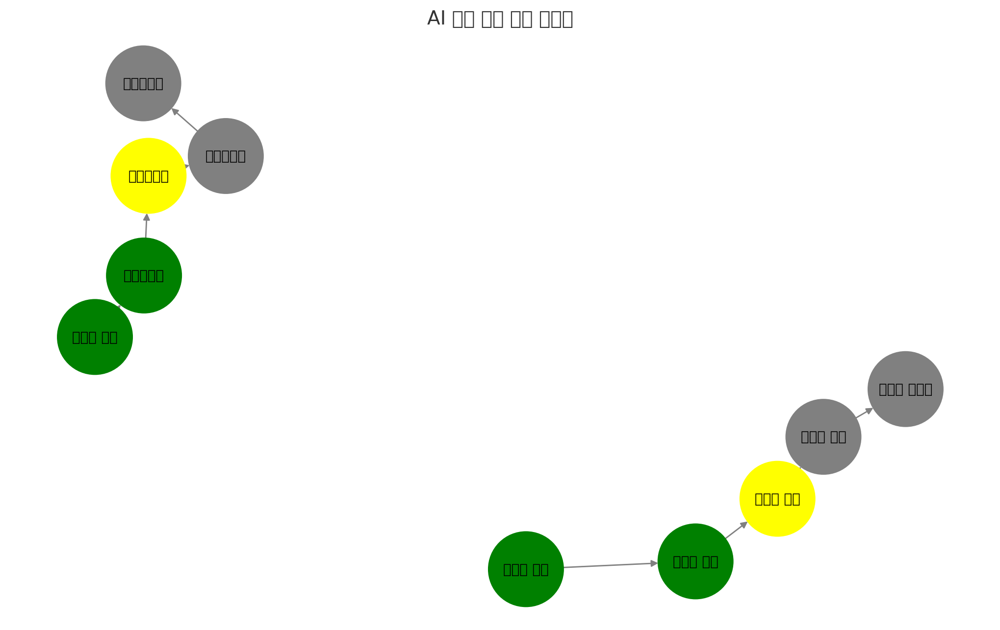

위 이미지는 AI 기반 수학 학습 지식맵을 시각화한 것입니다.

### **설명:**

-   **✔ (녹색)** → 이미 학습 완료한 개념
-   **★ (노란색)** → 현재 학습 중인 개념 (추천 학습 개념)
-   **⬜ (회색)** → 향후 학습할 개념

### **학습 흐름 예시**

1. **분수의 개념 → 분수의 덧셈** _(학습 완료)_
2. **현재 학습 중: 분수의 뺄셈**
3. **다음 학습 목표: 분수의 곱셈 → 분수의 나눗셈**

4. **정수의 개념 → 일차방정식** _(학습 완료)_
5. **현재 학습 중: 이차방정식**
6. **다음 학습 목표: 연립방정식 → 미분방정식**

이 지식맵을 활용하면 **학생이 현재 어디에 있고, 앞으로 어떤 개념을 학습해야 하는지** 직관적으로 이해할 수 있습니다. 🚀
